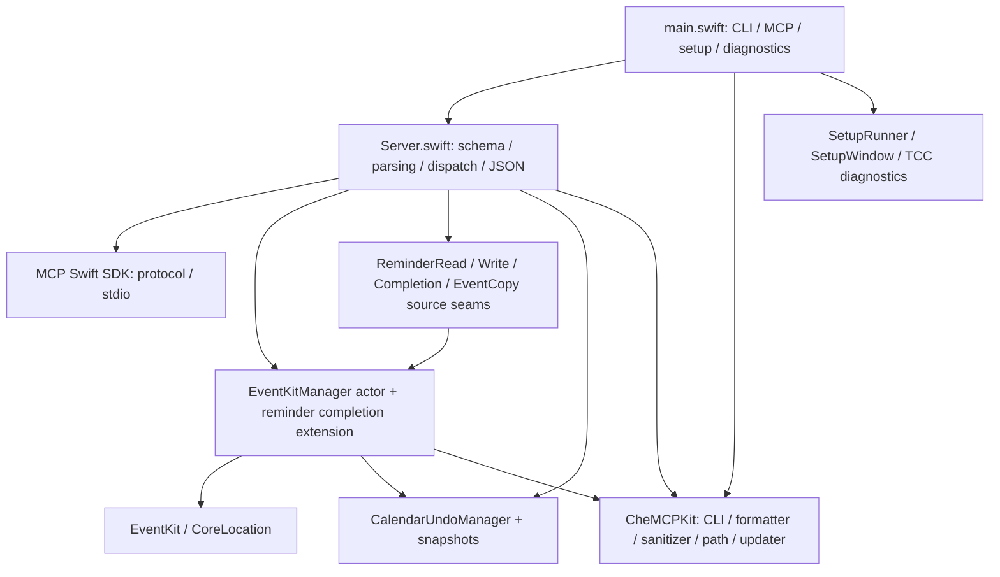

# SPE-968 · MCP 合同、状态行为与 fork 运行发布基线

> 研究交回快照：以下工作区、未 commit/push 等执行状态记录作者交回时的事实。主控于 2026-10-01 独立复核后集成；当前发布链接、状态与后续未知以研究票 resolution comment 为准。

调查日期：2026-10-01。研究票：[调查当前 MCP 合同、状态行为与 fork 发布运行基线](https://linear.app/icecoke/issue/SPE-968)；parent：[Apple Agenda MCP：日历与提醒全面覆盖决策地图](https://linear.app/icecoke/issue/SPE-961)。本文件是本机 WIP 研究交付，未经过主控核对或独立报告 review，不选择产品方案，不代表票已关闭。

## 结论与证据边界

- fork `main` 与研究 HEAD 为 `3ad64088feb82104982b6b3e7181f6bb4ca8af94`；upstream `main` 为 `4c4d39632b2fae998bb9f25209b067b19ae64329`。本次 fork 治理提交只增加文档/规则，产品源码与该 upstream 基线一致。证据是下方本轮 `git ls-remote`、`git diff --stat` 和本机 HEAD；不是安装或运行证据。
- 上游最新正式 release 是 [v1.18.0](https://github.com/PsychQuant/che-ical-mcp/releases/tag/v1.18.0)，2026-09-08 发布，tag 最终指向 `7371f99dd309944b212b98ac5f1d95486c9a327c`。upstream main 多出 5 个提交，已迁出 CLI/formatting/path/updater 到 kit，并加了 Developer ID、notarization 及“安装已验证原文件”保护；源码仍报 `1.18.0`，仅看版本不能区分 release 与 main。[Sources/CheICalMCP/Version.swift:4–24](https://github.com/winter-icecoke/apple-agenda-mcp/blob/3ad64088feb82104982b6b3e7181f6bb4ca8af94/Sources/CheICalMCP/Version.swift#L4-L24) [Sources/CheICalMCP/KitConfiguration.swift:10–17](https://github.com/winter-icecoke/apple-agenda-mcp/blob/3ad64088feb82104982b6b3e7181f6bb4ca8af94/Sources/CheICalMCP/KitConfiguration.swift#L10-L17) [Package.resolved:1–12](https://github.com/winter-icecoke/apple-agenda-mcp/blob/3ad64088feb82104982b6b3e7181f6bb4ca8af94/Package.resolved#L1-L12)
- [fork Releases 页面](https://github.com/winter-icecoke/apple-agenda-mcp/releases) 在本次浏览时显示没有 releases。没有本轮 fork build、签名、发布、安装或 MCP initialize 证据。
- 本机只读核对到配置入口和安装包 `mcp-server-apple-events@1.5.0`。这更新了 Day 1 的历史安装记录，但不证明当前服务会话：2026-10-01 09:18:24（UTC+8）的过滤进程快照没有匹配进程。没有调用个人对象或 TCC 权限 API，详见本机证据。
- 当前源代码声明、分发 29 个 tools；结果主要是 JSON 文本，没有 `outputSchema` / `structuredContent`。读工具中的 8 个结果还包有非 JSON 的信任边界文字。批量工具的部分失败通常仍是 MCP 成功结果，调用方必须读取各项 `failed/results/failures`。[Sources/CheICalMCP/Server.swift:117–1046](https://github.com/winter-icecoke/apple-agenda-mcp/blob/3ad64088feb82104982b6b3e7181f6bb4ca8af94/Sources/CheICalMCP/Server.swift#L117-L1046) [Sources/CheICalMCP/Server.swift:1050–1173](https://github.com/winter-icecoke/apple-agenda-mcp/blob/3ad64088feb82104982b6b3e7181f6bb4ca8af94/Sources/CheICalMCP/Server.swift#L1050-L1173) [Sources/CheICalMCP/Validation.swift:239–269](https://github.com/winter-icecoke/apple-agenda-mcp/blob/3ad64088feb82104982b6b3e7181f6bb4ca8af94/Sources/CheICalMCP/Validation.swift#L239-L269)
- copy/move 是 save-copy 后 remove-source；并非无损原生移动。undo 有内存 history 和部分失败处理，但恢复快照不完整；多种 redo 只返回“请手动重做”，handler 仍给 `success:true`。这些都是固定源码结论，未作本轮真实运行复现。[Sources/CheICalMCP/EventKit/EventKitManager.swift:1351–1411](https://github.com/winter-icecoke/apple-agenda-mcp/blob/3ad64088feb82104982b6b3e7181f6bb4ca8af94/Sources/CheICalMCP/EventKit/EventKitManager.swift#L1351-L1411) [Sources/CheICalMCP/EventKit/EventCopyOperation.swift:8–16](https://github.com/winter-icecoke/apple-agenda-mcp/blob/3ad64088feb82104982b6b3e7181f6bb4ca8af94/Sources/CheICalMCP/EventKit/EventCopyOperation.swift#L8-L16) [Sources/CheICalMCP/EventKit/EventKitManager.swift:1926–2160](https://github.com/winter-icecoke/apple-agenda-mcp/blob/3ad64088feb82104982b6b3e7181f6bb4ca8af94/Sources/CheICalMCP/EventKit/EventKitManager.swift#L1926-L2160) [Sources/CheICalMCP/Server.swift:1518–1535](https://github.com/winter-icecoke/apple-agenda-mcp/blob/3ad64088feb82104982b6b3e7181f6bb4ca8af94/Sources/CheICalMCP/Server.swift#L1518-L1535)

本报告区分五层：**官方 API 支持**、**当前源码实现**、**MCP 声明/handler 合同**、**本轮验证层级**、**限制或未知**。以下的“已实现”一律指固定源码可见；没有把 README、已有测试文件、正式 release 描述或别的 MCP 缺陷当成本轮运行成功。

## 版本、安装与会话基线

| 层 | 本轮事实 | 能证明什么 / 不能证明什么 |
|---|---|---|
| fork HEAD | `3ad64088feb82104982b6b3e7181f6bb4ca8af94`，branch `research/spe-968-mcp-baseline`；开工 `git status --short` 空 | 指定研究基线；不证明主工作区后来提交的文档或新 release |
| fork remote main | `git ls-remote origin refs/heads/main` 返回 `3ad64088…` | 查询时远端 main；不证明已安装 |
| upstream remote main | `git ls-remote upstream refs/heads/main` 返回 `4c4d3963…` | 查询时上游 main |
| 正式 release | v1.18.0；annotated tag object `8eeb5432fe2ba446777a68b1c1fa09672f1f3532`，peeled commit `7371f99d…` | tag object 与源码 commit 是两个值；release 页面、`git rev-parse` 与 `ls-remote ^{}` 相互核对 |
| release 后源码差异 | `34da29c`、`d2bcaa0`、`bdcbe7e`、`1db306a`、`4c4d396` 共 5 commits | kit 抽取和 updater 保护；并非已出下一个 release |
| source version | `AppVersion.current`、Info.plist、MCPB、plugin/marketplace 为 `1.18.0` | [Sources/CheICalMCP/Version.swift:4–24](https://github.com/winter-icecoke/apple-agenda-mcp/blob/3ad64088feb82104982b6b3e7181f6bb4ca8af94/Sources/CheICalMCP/Version.swift#L4-L24)、[Sources/CheICalMCP/Info.plist:5–20](https://github.com/winter-icecoke/apple-agenda-mcp/blob/3ad64088feb82104982b6b3e7181f6bb4ca8af94/Sources/CheICalMCP/Info.plist#L5-L20)、[mcpb/manifest.json:3–15](https://github.com/winter-icecoke/apple-agenda-mcp/blob/3ad64088feb82104982b6b3e7181f6bb4ca8af94/mcpb/manifest.json#L3-L15)、[.claude-plugin/marketplace.json:6–14](https://github.com/winter-icecoke/apple-agenda-mcp/blob/3ad64088feb82104982b6b3e7181f6bb4ca8af94/.claude-plugin/marketplace.json#L6-L14)；版本号不含 commit |
| registry snapshot | `server.json` 是 `io.github.PsychQuant/che-ical-mcp@1.14.1`，资产 URL 固定上游 v1.14.1 | 单独 registry 快照，不是当前 source version。[server.json:2–18](https://github.com/winter-icecoke/apple-agenda-mcp/blob/3ad64088feb82104982b6b3e7181f6bb4ca8af94/server.json#L2-L18) |
| 当前配置 | `~/.codex/config.toml` 的 `[mcp_servers.apple-events]`，仅取 `command/args` 中的精确路径 | 只证明启动指向；未读/输出 env、token、其他配置字段 |
| 当前安装包 | package.json 的 name/version 为 `mcp-server-apple-events` / `1.5.0`，bin 入口 `./dist/index.js` | 包元数据；未证明包内 Swift binary 的 commit、签名、TCC 或运行会话 |
| 活跃进程 | 09:18:24 过滤快照 `matched_processes=[]` | 快照未匹配，不能据此断言机器绝无其他安装/其他 host 会话 |
| fork 当前实际会话 | **未验证** | 没有 initialize/serverInfo、实际 tools/list、进程—文件—commit 对照 |

本机允许记录的精确指针：

- 配置命令：`/Users/leolau/.nvm/versions/node/v24.13.0/bin/node`。
- MCP 入口：`/Users/leolau/.codex/mcp/apple-events/node_modules/mcp-server-apple-events/dist/index.js`。
- 版本文件：`/Users/leolau/.codex/mcp/apple-events/node_modules/mcp-server-apple-events/package.json`。
- 包内 binary：同包 `bin/event`（52,095,536 bytes）、`bin/event-disclaim`（50,352 bytes）；`file` 显示两者均为 arm64+x86_64 universal Mach-O，可执行位已设。没有执行它们。
- 当次机器 `sw_vers -productVersion=27.0`、`uname -m=arm64`；不把上游 macOS 26.x 经验推为这台机器当前行为。

`dist/index.js:8,20-28` 导入并直接调用 `startServer`，没有 `--version` 前置退出分支；因此没有用 Node 入口试 `--version`。包内 `event` 的无副作用版本路径未确认，也没有运行。fork 源码的 `--version` / `-v` 在 `main.swift:7-9` 提前打印并退出，先于 EKEventStore/server/banner/setup；这是源码证明，因没有授权建立或启动 fork binary，本轮也未执行。[Sources/CheICalMCP/main.swift:1–17](https://github.com/winter-icecoke/apple-agenda-mcp/blob/3ad64088feb82104982b6b3e7181f6bb4ca8af94/Sources/CheICalMCP/main.swift#L1-L17)

仅检查过 `~/bin/CheICalMCP`、`/opt/homebrew/bin/CheICalMCP`、`/usr/local/bin/CheICalMCP`，均不存在；未遍历个人应用数据、MCPB 提取目录或整个磁盘。旧 apple-events 的“同日窗口 / 未来 ID”缺陷在 brief 中只是回归输入，本轮未复现，更不能迁移成 fork 的已知缺陷。[docs/PROJECT_BRIEF.md:8–17](https://github.com/winter-icecoke/apple-agenda-mcp/blob/3ad64088feb82104982b6b3e7181f6bb4ca8af94/docs/PROJECT_BRIEF.md#L8-L17)

## 协议、结果与输入验证

MCP 官方 [tools](https://modelcontextprotocol.io/specification/2025-11-25/server/tools) 允许 outputSchema 与 structuredContent，并区分 JSON-RPC 协议错误和 `isError:true` 工具执行错误；[lifecycle](https://modelcontextprotocol.io/specification/2025-11-25/basic/lifecycle) 要求先 initialize 协商能力和版本，再进入 operation；[stdio](https://modelcontextprotocol.io/specification/2025-11-25/basic/transports#stdio) 用换行分隔 JSON-RPC，stderr 可用于日志。这些是协议能力，不是本轮会话证据。

| 合同点 | 当前实现 | 验证 / 缺口 |
|---|---|---|
| Server / transport | `Server(name:che-ical-mcp,version:1.18.0,capabilities:tools)` + `StdioTransport`；仅注册 ListTools、CallTool | 没有声明 resources、prompts、订阅或 HTTP 服务；真正协商结果未知。[Sources/CheICalMCP/Server.swift:96–111](https://github.com/winter-icecoke/apple-agenda-mcp/blob/3ad64088feb82104982b6b3e7181f6bb4ca8af94/Sources/CheICalMCP/Server.swift#L96-L111) [Sources/CheICalMCP/Server.swift:1050–1063](https://github.com/winter-icecoke/apple-agenda-mcp/blob/3ad64088feb82104982b6b3e7181f6bb4ca8af94/Sources/CheICalMCP/Server.swift#L1050-L1063) |
| SDK | resolved Swift SDK `0.12.0` / `6132fd4b…`；SDK 有 outputSchema、structuredContent、tools cursor 和 initialize 协商实现 | 当前应用没有用这些输出能力；未运行 SDK/host 联调。[Package.resolved:57–65](https://github.com/winter-icecoke/apple-agenda-mcp/blob/3ad64088feb82104982b6b3e7181f6bb4ca8af94/Package.resolved#L57-L65) [Sources/MCP/Server/Tools.swift:11–24](https://github.com/modelcontextprotocol/swift-sdk/blob/6132fd4b5b4217ce4717c4775e4607f5c3120129/Sources/MCP/Server/Tools.swift#L11-L24) [Sources/MCP/Server/Tools.swift:309–350](https://github.com/modelcontextprotocol/swift-sdk/blob/6132fd4b5b4217ce4717c4775e4607f5c3120129/Sources/MCP/Server/Tools.swift#L309-L350) [Sources/MCP/Server/Tools.swift:405–420](https://github.com/modelcontextprotocol/swift-sdk/blob/6132fd4b5b4217ce4717c4775e4607f5c3120129/Sources/MCP/Server/Tools.swift#L405-L420) [Sources/MCP/Server/Server.swift:902–919](https://github.com/modelcontextprotocol/swift-sdk/blob/6132fd4b5b4217ce4717c4775e4607f5c3120129/Sources/MCP/Server/Server.swift#L902-L919) |
| tools/list | 静态完整 29 项；handler 忽略请求 cursor，没有 nextCursor | 与业务数据的分页不同；本轮只静态清点。[Sources/CheICalMCP/Server.swift:117–1046](https://github.com/winter-icecoke/apple-agenda-mcp/blob/3ad64088feb82104982b6b3e7181f6bb4ca8af94/Sources/CheICalMCP/Server.swift#L117-L1046) [Sources/CheICalMCP/Server.swift:1050–1054](https://github.com/winter-icecoke/apple-agenda-mcp/blob/3ad64088feb82104982b6b3e7181f6bb4ca8af94/Sources/CheICalMCP/Server.swift#L1050-L1054) |
| tools/call 成功 | `content:[text(result)]`；isError 未设；所有 handler 返回 String | JSON 在 text 内；不是 structuredContent；部分批量失败仍走成功分支。[Sources/CheICalMCP/Server.swift:1067–1090](https://github.com/winter-icecoke/apple-agenda-mcp/blob/3ad64088feb82104982b6b3e7181f6bb4ca8af94/Sources/CheICalMCP/Server.swift#L1067-L1090) |
| outer failure | `content:[text("Error: <sanitized>")],isError:true` | 未给统一 JSON error 对象、retryable、operation ID 或 partial-state 字段；未知 tool 也被此 catch 收为 tool error。[Sources/CheICalMCP/Server.swift:1067–1090](https://github.com/winter-icecoke/apple-agenda-mcp/blob/3ad64088feb82104982b6b3e7181f6bb4ca8af94/Sources/CheICalMCP/Server.swift#L1067-L1090) [Sources/CheICalMCP/Server.swift:1170–1172](https://github.com/winter-icecoke/apple-agenda-mcp/blob/3ad64088feb82104982b6b3e7181f6bb4ca8af94/Sources/CheICalMCP/Server.swift#L1170-L1172) |
| framework error | EKErrorDomain → `eventkit_error_<abs(code)>`；其他错误走 kit sanitizer；trusted errors 可直达描述 | code 与 authored 描述混用，不是统一枚举；raw detail 到 stderr，不能把日志复制到公开材料。[Sources/CheICalMCP/EventKit/EventKitErrorSanitizer.swift:5–61](https://github.com/winter-icecoke/apple-agenda-mcp/blob/3ad64088feb82104982b6b3e7181f6bb4ca8af94/Sources/CheICalMCP/EventKit/EventKitErrorSanitizer.swift#L5-L61) |
| CLI | 共用 executeToolCall；CLI 不加 read wrapper；兼容 envelope `{"error":true,"message":"<sanitized>"}`，kit catch 会 `Shutdown.terminate(1)` | 成功打印 handler JSON；error stdout 与 MCP 的 `Error:` 文本不同。[Sources/CheICalMCP/main.swift:134–145](https://github.com/winter-icecoke/apple-agenda-mcp/blob/3ad64088feb82104982b6b3e7181f6bb4ca8af94/Sources/CheICalMCP/main.swift#L134-L145) [Sources/CheICalMCP/KitConfiguration.swift:19–40](https://github.com/winter-icecoke/apple-agenda-mcp/blob/3ad64088feb82104982b6b3e7181f6bb4ca8af94/Sources/CheICalMCP/KitConfiguration.swift#L19-L40) [Sources/CheMCPKit/CLIRunner.swift:264–329](https://github.com/PsychQuant/che-mcp-kit-swift/blob/bd80410a9c44098e7d42a1081d6f75baf85223cc/Sources/CheMCPKit/CLIRunner.swift#L264-L329) |
| trust wrapper | list_events/search_events/list_events_quick/check_conflicts/find_duplicate_events/list_reminders/search_reminders/list_reminder_tags 共 8 个加前后文字 | 整段不是纯 JSON；list_calendars、history、mutation title 等不在此集合；这里只记录边界，不评价已抵御攻击。[Sources/CheICalMCP/Validation.swift:239–269](https://github.com/winter-icecoke/apple-agenda-mcp/blob/3ad64088feb82104982b6b3e7181f6bb4ca8af94/Sources/CheICalMCP/Validation.swift#L239-L269) |
| annotations | 显式 readOnly/destructive/openWorld；全部 openWorldHint=false；update、complete、copy/move/delete/history mutation 标 destructive | 官方把 annotations 定义为 hints，不能当权限隔离或执行确认；源码未显式填 idempotentHint。[Sources/CheICalMCP/Server.swift:117–1046](https://github.com/winter-icecoke/apple-agenda-mcp/blob/3ad64088feb82104982b6b3e7181f6bb4ca8af94/Sources/CheICalMCP/Server.swift#L117-L1046) |
| schema / runtime | schemas 多数没有 additionalProperties:false；handler 手动取 Value，并非自动执行完整 JSON Schema 校验 | 部分 enum/字符串/数组错误会 fallback 或丢弃；下列差异需要合同核对。[Sources/CheICalMCP/Server.swift:117–1046](https://github.com/winter-icecoke/apple-agenda-mcp/blob/3ad64088feb82104982b6b3e7181f6bb4ca8af94/Sources/CheICalMCP/Server.swift#L117-L1046) [Sources/CheICalMCP/Server.swift:1177–1230](https://github.com/winter-icecoke/apple-agenda-mcp/blob/3ad64088feb82104982b6b3e7181f6bb4ca8af94/Sources/CheICalMCP/Server.swift#L1177-L1230) [Sources/CheICalMCP/Server.swift:2604–2770](https://github.com/winter-icecoke/apple-agenda-mcp/blob/3ad64088feb82104982b6b3e7181f6bb4ca8af94/Sources/CheICalMCP/Server.swift#L2604-L2770) |

明确的校验：标题≤255、notes≤65,535、location≤1,024 字符；事件 URL 限 http/https；`detail_level=summary|standard`；`display_timezone` 限 IANA 或 UTC；`fields` 必须非空 string 数组且命中 allowlist；多数查询 limit 为 1…10,000；整数接受整值 double，不接受 string；所有当前 boolean 参数只接受 JSON bool，省略/null 用默认。[Sources/CheICalMCP/Validation.swift:9–43](https://github.com/winter-icecoke/apple-agenda-mcp/blob/3ad64088feb82104982b6b3e7181f6bb4ca8af94/Sources/CheICalMCP/Validation.swift#L9-L43) [Sources/CheICalMCP/Validation.swift:48–217](https://github.com/winter-icecoke/apple-agenda-mcp/blob/3ad64088feb82104982b6b3e7181f6bb4ca8af94/Sources/CheICalMCP/Validation.swift#L48-L217)

仍有源码可见差异，不能以 schema 文案代替：

1. `create_calendar.type` 不是 `reminder` 就按 event；`list_calendars.type` 未知值变成两类全取。多个 filter/sort/span/match_mode 的非法 string 会进入 default；quick range 未知值变为 today。[Sources/CheICalMCP/Server.swift:1177–1220](https://github.com/winter-icecoke/apple-agenda-mcp/blob/3ad64088feb82104982b6b3e7181f6bb4ca8af94/Sources/CheICalMCP/Server.swift#L1177-L1220) [Sources/CheICalMCP/Server.swift:1258–1282](https://github.com/winter-icecoke/apple-agenda-mcp/blob/3ad64088feb82104982b6b3e7181f6bb4ca8af94/Sources/CheICalMCP/Server.swift#L1258-L1282) [Sources/CheICalMCP/Server.swift:1407–1413](https://github.com/winter-icecoke/apple-agenda-mcp/blob/3ad64088feb82104982b6b3e7181f6bb4ca8af94/Sources/CheICalMCP/Server.swift#L1407-L1413) [Sources/CheICalMCP/Server.swift:2972–3018](https://github.com/winter-icecoke/apple-agenda-mcp/blob/3ad64088feb82104982b6b3e7181f6bb4ca8af94/Sources/CheICalMCP/Server.swift#L2972-L3018)
2. `update_event` handler 读取/校验 `url`，inputSchema 未列 `url`；`update_reminder.priority` 直接 `.intValue`，类型错误变成没有更新；普通 batch IDs / keywords / tags 多用 compactMap 丢弃非 string，cleanup binding IDs 与 fields 则逐项严格校验。[Sources/CheICalMCP/Server.swift:328–414](https://github.com/winter-icecoke/apple-agenda-mcp/blob/3ad64088feb82104982b6b3e7181f6bb4ca8af94/Sources/CheICalMCP/Server.swift#L328-L414) [Sources/CheICalMCP/Server.swift:1385–1455](https://github.com/winter-icecoke/apple-agenda-mcp/blob/3ad64088feb82104982b6b3e7181f6bb4ca8af94/Sources/CheICalMCP/Server.swift#L1385-L1455) [Sources/CheICalMCP/Server.swift:1689–1757](https://github.com/winter-icecoke/apple-agenda-mcp/blob/3ad64088feb82104982b6b3e7181f6bb4ca8af94/Sources/CheICalMCP/Server.swift#L1689-L1757) [Sources/CheICalMCP/Server.swift:1944–1956](https://github.com/winter-icecoke/apple-agenda-mcp/blob/3ad64088feb82104982b6b3e7181f6bb4ca8af94/Sources/CheICalMCP/Server.swift#L1944-L1956) [Sources/CheICalMCP/Server.swift:2016–2045](https://github.com/winter-icecoke/apple-agenda-mcp/blob/3ad64088feb82104982b6b3e7181f6bb4ca8af94/Sources/CheICalMCP/Server.swift#L2016-L2045)
3. `calendar_source` 单独出现：提醒 list/search/tags/cleanup 明确拒绝；事件 list/search/conflicts 的 manager 仅在 calendar_name 存在时使用 source，source-alone 被忽略。[Sources/CheICalMCP/Server.swift:1566–1589](https://github.com/winter-icecoke/apple-agenda-mcp/blob/3ad64088feb82104982b6b3e7181f6bb4ca8af94/Sources/CheICalMCP/Server.swift#L1566-L1589) [Sources/CheICalMCP/Server.swift:1800–1840](https://github.com/winter-icecoke/apple-agenda-mcp/blob/3ad64088feb82104982b6b3e7181f6bb4ca8af94/Sources/CheICalMCP/Server.swift#L1800-L1840) [Sources/CheICalMCP/EventKit/EventKitManager.swift:493–511](https://github.com/winter-icecoke/apple-agenda-mcp/blob/3ad64088feb82104982b6b3e7181f6bb4ca8af94/Sources/CheICalMCP/EventKit/EventKitManager.swift#L493-L511) [Sources/CheICalMCP/EventKit/EventKitManager.swift:1084–1110](https://github.com/winter-icecoke/apple-agenda-mcp/blob/3ad64088feb82104982b6b3e7181f6bb4ca8af94/Sources/CheICalMCP/EventKit/EventKitManager.swift#L1084-L1110) [Sources/CheICalMCP/EventKit/EventKitManager.swift:1321–1340](https://github.com/winter-icecoke/apple-agenda-mcp/blob/3ad64088feb82104982b6b3e7181f6bb4ca8af94/Sources/CheICalMCP/EventKit/EventKitManager.swift#L1321-L1340)
4. 更新/删除日历无实体类型输入，manager 同时检查 Calendar 和 Reminders 权限；单类权限不足也会挡住调用。该行为不是公开 API 必然要求。[Sources/CheICalMCP/EventKit/EventKitManager.swift:427–465](https://github.com/winter-icecoke/apple-agenda-mcp/blob/3ad64088feb82104982b6b3e7181f6bb4ca8af94/Sources/CheICalMCP/EventKit/EventKitManager.swift#L427-L465)

4. `location_trigger` 的 schema 要求 title/latitude/longitude/proximity；handler 要前三项，但 proximity 省略或非 `leave` 值默认 enter，radius 类型不合则默认100。这是 schema 与 handler 的差异，未经运行验证。[Sources/CheICalMCP/Server.swift:553–567](https://github.com/winter-icecoke/apple-agenda-mcp/blob/3ad64088feb82104982b6b3e7181f6bb4ca8af94/Sources/CheICalMCP/Server.swift#L553-L567) [Sources/CheICalMCP/Server.swift:3177–3195](https://github.com/winter-icecoke/apple-agenda-mcp/blob/3ad64088feb82104982b6b3e7181f6bb4ca8af94/Sources/CheICalMCP/Server.swift#L3177-L3195)

## 全部 29 个 tools

符号：`s`=string，`b`=JSON boolean，`i`=integer，`n`=number，`[]`=array，`o`=object；`*` 为 schema required，`?` 为可省略。这里只压缩记法，完整嵌套、description 与 required 以每行固定源码为准。所有行共享上节 outer error；表中的“错误/边界”补充 handler 差异。

通用输入：`Scope=calendar_name?s,calendar_source?s`；`Projection=detail_level?s(summary|standard),display_timezone?s,fields?[]s`；`Recurrence=o{frequency*s(daily|weekly|monthly|yearly),interval?i,end_date?s,occurrence_count?i,days_of_week?[]i,days_of_month?[]i}`，仅 event create/batch 另含 `excluded_occurrence_dates?[]s`。`Structured=o{title*s,latitude?n,longitude?n,radius?n}`；`Trigger=o{title*s,latitude*n,longitude*n,radius?n,proximity*s(enter|leave)}`。这些是 MCP 子集，不表示全部 EKRecurrenceRule/EKAlarm 能力。[Sources/CheICalMCP/Server.swift:252–414](https://github.com/winter-icecoke/apple-agenda-mcp/blob/3ad64088feb82104982b6b3e7181f6bb4ca8af94/Sources/CheICalMCP/Server.swift#L252-L414) [Sources/CheICalMCP/Server.swift:502–623](https://github.com/winter-icecoke/apple-agenda-mcp/blob/3ad64088feb82104982b6b3e7181f6bb4ca8af94/Sources/CheICalMCP/Server.swift#L502-L623) [Sources/CheICalMCP/Server.swift:777–830](https://github.com/winter-icecoke/apple-agenda-mcp/blob/3ad64088feb82104982b6b3e7181f6bb4ca8af94/Sources/CheICalMCP/Server.swift#L777-L830)

通用事件结果 `Event`：`id,title,start_date,start_date_local,end_date,end_date_local,timezone,is_all_day,calendar`；可选 location/notes/url/is_recurring/recurrence_rules/event_recurrence_rules/structured_location/attendees/organizer。summary 通常省略扩展字段；显式 fields 优先且始终保留 id；没有 calendar/source ID、occurrence_date、isDetached 或 alarms。[Sources/CheICalMCP/Server.swift:2843–2888](https://github.com/winter-icecoke/apple-agenda-mcp/blob/3ad64088feb82104982b6b3e7181f6bb4ca8af94/Sources/CheICalMCP/Server.swift#L2843-L2888) [Sources/CheICalMCP/Validation.swift:99–103](https://github.com/winter-icecoke/apple-agenda-mcp/blob/3ad64088feb82104982b6b3e7181f6bb4ca8af94/Sources/CheICalMCP/Validation.swift#L99-L103)

通用提醒结果 `Reminder`：`id,title,is_completed,priority,calendar,timezone`；可选 clean notes/tags/due_date/due_date_local/completion_date/completion_date_local/location_trigger，加 recurrenceMetadata（包括实体名与 legacy alias、due 的精度/zone）。list 另有 creation_date/local、is_overdue；search 没有这些附加项。[Sources/CheICalMCP/Server.swift:1605–1646](https://github.com/winter-icecoke/apple-agenda-mcp/blob/3ad64088feb82104982b6b3e7181f6bb4ca8af94/Sources/CheICalMCP/Server.swift#L1605-L1646) [Sources/CheICalMCP/Server.swift:1842–1870](https://github.com/winter-icecoke/apple-agenda-mcp/blob/3ad64088feb82104982b6b3e7181f6bb4ca8af94/Sources/CheICalMCP/Server.swift#L1842-L1870) [Sources/CheICalMCP/ReminderRecurrence.swift:149–172](https://github.com/winter-icecoke/apple-agenda-mcp/blob/3ad64088feb82104982b6b3e7181f6bb4ca8af94/Sources/CheICalMCP/ReminderRecurrence.swift#L149-L172)

| Tool | 输入 | 输出 / 额外错误或边界 | 固定源码 |
|---|---|---|---|
| list_calendars | type?s(event/reminder，文字约定) | calendar[]：id,title,type（EKCalendarType rawValue）,allowsContentModifications,isSubscribed,source,source_type；无分页 | [Sources/CheICalMCP/Server.swift:120–133](https://github.com/winter-icecoke/apple-agenda-mcp/blob/3ad64088feb82104982b6b3e7181f6bb4ca8af94/Sources/CheICalMCP/Server.swift#L120-L133) [Sources/CheICalMCP/Server.swift:1177–1196](https://github.com/winter-icecoke/apple-agenda-mcp/blob/3ad64088feb82104982b6b3e7181f6bb4ca8af94/Sources/CheICalMCP/Server.swift#L1177-L1196) |
| create_calendar | title*s,type*s,color?s | action=created/skipped；calendar,id；skipped reason=duplicate；没有指定 source 参数 | [Sources/CheICalMCP/Server.swift:134–156](https://github.com/winter-icecoke/apple-agenda-mcp/blob/3ad64088feb82104982b6b3e7181f6bb4ca8af94/Sources/CheICalMCP/Server.swift#L134-L156) [Sources/CheICalMCP/Server.swift:1198–1220](https://github.com/winter-icecoke/apple-agenda-mcp/blob/3ad64088feb82104982b6b3e7181f6bb4ca8af94/Sources/CheICalMCP/Server.swift#L1198-L1220) |
| delete_calendar | id*s | action=deleted,id；没有 undo | [Sources/CheICalMCP/Server.swift:157–171](https://github.com/winter-icecoke/apple-agenda-mcp/blob/3ad64088feb82104982b6b3e7181f6bb4ca8af94/Sources/CheICalMCP/Server.swift#L157-L171) [Sources/CheICalMCP/Server.swift:1221–1230](https://github.com/winter-icecoke/apple-agenda-mcp/blob/3ad64088feb82104982b6b3e7181f6bb4ca8af94/Sources/CheICalMCP/Server.swift#L1221-L1230) |
| update_calendar | id*s,title?s,color?s | action=updated,calendar,id；title/color 至少一项；没有 undo | [Sources/CheICalMCP/Server.swift:172–193](https://github.com/winter-icecoke/apple-agenda-mcp/blob/3ad64088feb82104982b6b3e7181f6bb4ca8af94/Sources/CheICalMCP/Server.swift#L172-L193) [Sources/CheICalMCP/Server.swift:1779–1798](https://github.com/winter-icecoke/apple-agenda-mcp/blob/3ad64088feb82104982b6b3e7181f6bb4ca8af94/Sources/CheICalMCP/Server.swift#L1779-L1798) |
| list_events | start_date*s,end_date*s,Scope,filter?s(all/past/future/all_day),sort?s(asc/desc),limit?i,Projection | event_count（过滤后、limit 前）,events[]Event,metadata(total_in_range,total_after_filter,filter,sort,limit?),display_timezone? | [Sources/CheICalMCP/Server.swift:197–250](https://github.com/winter-icecoke/apple-agenda-mcp/blob/3ad64088feb82104982b6b3e7181f6bb4ca8af94/Sources/CheICalMCP/Server.swift#L197-L250) [Sources/CheICalMCP/Server.swift:1231–1312](https://github.com/winter-icecoke/apple-agenda-mcp/blob/3ad64088feb82104982b6b3e7181f6bb4ca8af94/Sources/CheICalMCP/Server.swift#L1231-L1312) |
| create_event | title*s,start_time*s,end_time*s,calendar_name*s,calendar_source?s,notes?s,location?s,url?s,all_day?b,alarms_minutes_offsets?[]i,recurrence?Recurrence,timezone?s,structured_location?Structured | action=created/skipped,title,id,reason?；请求排除日期时 excluded_occurrence_dates/exclusion_count；同请求 all_day+timezone 拒绝 | [Sources/CheICalMCP/Server.swift:252–326](https://github.com/winter-icecoke/apple-agenda-mcp/blob/3ad64088feb82104982b6b3e7181f6bb4ca8af94/Sources/CheICalMCP/Server.swift#L252-L326) [Sources/CheICalMCP/Server.swift:1314–1383](https://github.com/winter-icecoke/apple-agenda-mcp/blob/3ad64088feb82104982b6b3e7181f6bb4ca8af94/Sources/CheICalMCP/Server.swift#L1314-L1383) |
| update_event | event_id*s,title?s,start_time?s,end_time?s,notes?s,location?s,all_day?b,Scope,recurrence?Recurrence,alarms_minutes_offsets?[]i,clear_recurrence?b,structured_location?Structured,timezone?s,clear_timezone?b,span?s(this/future/all),occurrence_date?s | action=updated,title,id（echo 输入 ID）；url handler 可用但 schema 漏项；timezone/clear_timezone 互斥；重复 this/future 要 occurrence_date | [Sources/CheICalMCP/Server.swift:328–414](https://github.com/winter-icecoke/apple-agenda-mcp/blob/3ad64088feb82104982b6b3e7181f6bb4ca8af94/Sources/CheICalMCP/Server.swift#L328-L414) [Sources/CheICalMCP/Server.swift:1385–1455](https://github.com/winter-icecoke/apple-agenda-mcp/blob/3ad64088feb82104982b6b3e7181f6bb4ca8af94/Sources/CheICalMCP/Server.swift#L1385-L1455) |
| delete_event | event_id*s,span?s(this/future/all，默认this),occurrence_date?s | action=deleted,id,span；重复 this/future 要 occurrence_date；all 走 series path | [Sources/CheICalMCP/Server.swift:416–435](https://github.com/winter-icecoke/apple-agenda-mcp/blob/3ad64088feb82104982b6b3e7181f6bb4ca8af94/Sources/CheICalMCP/Server.swift#L416-L435) [Sources/CheICalMCP/Server.swift:1458–1476](https://github.com/winter-icecoke/apple-agenda-mcp/blob/3ad64088feb82104982b6b3e7181f6bb4ca8af94/Sources/CheICalMCP/Server.swift#L1458-L1476) |
| undo | discard_id?s | 普通 action=undo,success,message；空栈 success=false；discard 要 history 顶部 UUID，回 action=discarded_undo,success,id,description,undo_available,redo_available；busy/empty/stale 报错 | [Sources/CheICalMCP/Server.swift:439–448](https://github.com/winter-icecoke/apple-agenda-mcp/blob/3ad64088feb82104982b6b3e7181f6bb4ca8af94/Sources/CheICalMCP/Server.swift#L439-L448) [Sources/CheICalMCP/Server.swift:1480–1516](https://github.com/winter-icecoke/apple-agenda-mcp/blob/3ad64088feb82104982b6b3e7181f6bb4ca8af94/Sources/CheICalMCP/Server.swift#L1480-L1516) |
| redo | 无声明参数 | action=redo,success,message；空栈 success=false；部分分支只有手动提示却 success=true | [Sources/CheICalMCP/Server.swift:450–457](https://github.com/winter-icecoke/apple-agenda-mcp/blob/3ad64088feb82104982b6b3e7181f6bb4ca8af94/Sources/CheICalMCP/Server.swift#L450-L457) [Sources/CheICalMCP/Server.swift:1518–1535](https://github.com/winter-icecoke/apple-agenda-mcp/blob/3ad64088feb82104982b6b3e7181f6bb4ca8af94/Sources/CheICalMCP/Server.swift#L1518-L1535) |
| undo_history | limit?i（默认10，1…10000） | undo_available,redo_available,history[{index,id,description,time(HH:mm:ss)}]；不返回完整 ISO timestamp 或 redo 列表 | [Sources/CheICalMCP/Server.swift:459–471](https://github.com/winter-icecoke/apple-agenda-mcp/blob/3ad64088feb82104982b6b3e7181f6bb4ca8af94/Sources/CheICalMCP/Server.swift#L459-L471) [Sources/CheICalMCP/Server.swift:1537–1562](https://github.com/winter-icecoke/apple-agenda-mcp/blob/3ad64088feb82104982b6b3e7181f6bb4ca8af94/Sources/CheICalMCP/Server.swift#L1537-L1562) |
| list_reminders | completed?b,filter?s(all/incomplete/completed/overdue),sort?s(due_date/creation_date/priority/title),limit?i,Scope | reminder_count（limit 前）,reminders[]Reminder,metadata(total_fetched,total_after_filter,filter,sort,limit?)；filter 优先于 completed，但仍校验 completed 类型 | [Sources/CheICalMCP/Server.swift:475–500](https://github.com/winter-icecoke/apple-agenda-mcp/blob/3ad64088feb82104982b6b3e7181f6bb4ca8af94/Sources/CheICalMCP/Server.swift#L475-L500) [Sources/CheICalMCP/Server.swift:1566–1647](https://github.com/winter-icecoke/apple-agenda-mcp/blob/3ad64088feb82104982b6b3e7181f6bb4ca8af94/Sources/CheICalMCP/Server.swift#L1566-L1647) |
| create_reminder | title*s,calendar_name*s,calendar_source?s,notes?s,due_date?s,priority?i,recurrence?Recurrence,tags?[]s,location_trigger?Trigger | action=created/skipped,title,id,reason?,tags?；tags 写入 notes，非原生 Reminders tags | [Sources/CheICalMCP/Server.swift:502–572](https://github.com/winter-icecoke/apple-agenda-mcp/blob/3ad64088feb82104982b6b3e7181f6bb4ca8af94/Sources/CheICalMCP/Server.swift#L502-L572) [Sources/CheICalMCP/Server.swift:1649–1687](https://github.com/winter-icecoke/apple-agenda-mcp/blob/3ad64088feb82104982b6b3e7181f6bb4ca8af94/Sources/CheICalMCP/Server.swift#L1649-L1687) |
| update_reminder | reminder_id*s,title?s,notes?s,due_date?s,clear_due_date?b,priority?i,Scope,location_trigger?Trigger,clear_location_trigger?b,tags?[]s,clear_tags?b | action=updated,title,id；due_date/clear_due_date 互斥；没有 recurrence 更新/清除参数 | [Sources/CheICalMCP/Server.swift:574–623](https://github.com/winter-icecoke/apple-agenda-mcp/blob/3ad64088feb82104982b6b3e7181f6bb4ca8af94/Sources/CheICalMCP/Server.swift#L574-L623) [Sources/CheICalMCP/Server.swift:1689–1757](https://github.com/winter-icecoke/apple-agenda-mcp/blob/3ad64088feb82104982b6b3e7181f6bb4ca8af94/Sources/CheICalMCP/Server.swift#L1689-L1757) |
| complete_reminder | reminder_id*s,completed?b（默认true；false reopen） | action=completed（含 reopen）,id,title,is_completed,has_recurrence,observed,operation(type,status,requested_completed,target),next_occurrence(status,reason?,reminder),message；operation 与观察状态分开 | [Sources/CheICalMCP/Server.swift:625–636](https://github.com/winter-icecoke/apple-agenda-mcp/blob/3ad64088feb82104982b6b3e7181f6bb4ca8af94/Sources/CheICalMCP/Server.swift#L625-L636) [Sources/CheICalMCP/Server.swift:1759–1768](https://github.com/winter-icecoke/apple-agenda-mcp/blob/3ad64088feb82104982b6b3e7181f6bb4ca8af94/Sources/CheICalMCP/Server.swift#L1759-L1768) [Sources/CheICalMCP/ReminderCompletion.swift:146–191](https://github.com/winter-icecoke/apple-agenda-mcp/blob/3ad64088feb82104982b6b3e7181f6bb4ca8af94/Sources/CheICalMCP/ReminderCompletion.swift#L146-L191) |
| delete_reminder | reminder_id*s | action=deleted,id；单个删除有 snapshot history | [Sources/CheICalMCP/Server.swift:638–648](https://github.com/winter-icecoke/apple-agenda-mcp/blob/3ad64088feb82104982b6b3e7181f6bb4ca8af94/Sources/CheICalMCP/Server.swift#L638-L648) [Sources/CheICalMCP/Server.swift:1770–1777](https://github.com/winter-icecoke/apple-agenda-mcp/blob/3ad64088feb82104982b6b3e7181f6bb4ca8af94/Sources/CheICalMCP/Server.swift#L1770-L1777) |
| search_reminders | keyword?s,keywords?[]s,match_mode?s(any/all),tag?s,Scope,completed?b,limit?i | keyword(s)/tag 至少一类；match_mode,reminder_count,reminders[]Reminder,keywords?,tag_filter?,limit? | [Sources/CheICalMCP/Server.swift:650–677](https://github.com/winter-icecoke/apple-agenda-mcp/blob/3ad64088feb82104982b6b3e7181f6bb4ca8af94/Sources/CheICalMCP/Server.swift#L650-L677) [Sources/CheICalMCP/Server.swift:1800–1871](https://github.com/winter-icecoke/apple-agenda-mcp/blob/3ad64088feb82104982b6b3e7181f6bb4ca8af94/Sources/CheICalMCP/Server.swift#L1800-L1871) |
| search_events | keyword?s,keywords?[]s,match_mode?s(any/all),start_date?s,end_date?s,Scope,limit?i,Projection | 至少有一个 keyword；keywords,match_mode,event_count（limit前）,searched_range(start/local,end/local,is_default_range),events[]Event,limit?,display_timezone? | [Sources/CheICalMCP/Server.swift:683–724](https://github.com/winter-icecoke/apple-agenda-mcp/blob/3ad64088feb82104982b6b3e7181f6bb4ca8af94/Sources/CheICalMCP/Server.swift#L683-L724) [Sources/CheICalMCP/Server.swift:2159–2227](https://github.com/winter-icecoke/apple-agenda-mcp/blob/3ad64088feb82104982b6b3e7181f6bb4ca8af94/Sources/CheICalMCP/Server.swift#L2159-L2227) |
| list_events_quick | range*s,week_starts_on?s,Scope,limit?i,Projection | range,start_date/local,end_date/local,timezone,event_count（limit前）,events[]Event,week_starts_on?（本/下周）,limit?,display_timezone?；快捷词见窗口节 | [Sources/CheICalMCP/Server.swift:728–773](https://github.com/winter-icecoke/apple-agenda-mcp/blob/3ad64088feb82104982b6b3e7181f6bb4ca8af94/Sources/CheICalMCP/Server.swift#L728-L773) [Sources/CheICalMCP/Server.swift:2229–2287](https://github.com/winter-icecoke/apple-agenda-mcp/blob/3ad64088feb82104982b6b3e7181f6bb4ca8af94/Sources/CheICalMCP/Server.swift#L2229-L2287) |
| create_events_batch | events*[]o；每项 required title/start_time/end_time/calendar_name；optional notes/location/calendar_source/all_day/recurrence/timezone/structured_location | total,succeeded,failed,results[{index,success,event_id?,title?,skipped?,error?,excluded_occurrence_dates?,exclusion_count?}],skipped?,similar_events?,similar_events_errors?；不支持单项 url/alarms 参数 | [Sources/CheICalMCP/Server.swift:777–830](https://github.com/winter-icecoke/apple-agenda-mcp/blob/3ad64088feb82104982b6b3e7181f6bb4ca8af94/Sources/CheICalMCP/Server.swift#L777-L830) [Sources/CheICalMCP/Server.swift:2290–2483](https://github.com/winter-icecoke/apple-agenda-mcp/blob/3ad64088feb82104982b6b3e7181f6bb4ca8af94/Sources/CheICalMCP/Server.swift#L2290-L2483) |
| check_conflicts | start_time*s,end_time*s,Scope,exclude_event_id?s | has_conflicts,conflict_count,check_range(start/local,end/local),conflicts[]Event；只查时间重叠 | [Sources/CheICalMCP/Server.swift:834–848](https://github.com/winter-icecoke/apple-agenda-mcp/blob/3ad64088feb82104982b6b3e7181f6bb4ca8af94/Sources/CheICalMCP/Server.swift#L834-L848) [Sources/CheICalMCP/Server.swift:2486–2522](https://github.com/winter-icecoke/apple-agenda-mcp/blob/3ad64088feb82104982b6b3e7181f6bb4ca8af94/Sources/CheICalMCP/Server.swift#L2486-L2522) |
| copy_event | event_id*s,target_calendar*s,target_calendar_source?s,delete_original?b（默认false） | action=copied/moved,title,target_calendar,new_id；失败只外层 error，无已保存 copy 的 ID/阶段 | [Sources/CheICalMCP/Server.swift:852–865](https://github.com/winter-icecoke/apple-agenda-mcp/blob/3ad64088feb82104982b6b3e7181f6bb4ca8af94/Sources/CheICalMCP/Server.swift#L852-L865) [Sources/CheICalMCP/Server.swift:2525–2544](https://github.com/winter-icecoke/apple-agenda-mcp/blob/3ad64088feb82104982b6b3e7181f6bb4ca8af94/Sources/CheICalMCP/Server.swift#L2525-L2544) |
| move_events_batch | event_ids*[]s,target_calendar*s,target_calendar_source?s | total,succeeded,failed,target_calendar,results[{event_id,success,new_event_id?,title?,error?}]；逐项 copy+delete | [Sources/CheICalMCP/Server.swift:869–885](https://github.com/winter-icecoke/apple-agenda-mcp/blob/3ad64088feb82104982b6b3e7181f6bb4ca8af94/Sources/CheICalMCP/Server.swift#L869-L885) [Sources/CheICalMCP/Server.swift:2548–2600](https://github.com/winter-icecoke/apple-agenda-mcp/blob/3ad64088feb82104982b6b3e7181f6bb4ca8af94/Sources/CheICalMCP/Server.swift#L2548-L2600) |
| delete_events_batch | event_ids?[]s 或 calendar_name?s+before_date?s/after_date?s 至少一个；calendar_source?s,dry_run?b（默认true）,span?s（默认this） | preview：dry_run,mode,total,events_to_delete[{event_id,start_date_local,end_date_local 或 error}],message，date 模式 calendar/before_date?/after_date?；execute：dry_run,mode,total,succeeded,failed,span,failures?，date 模式 calendar | [Sources/CheICalMCP/Server.swift:889–927](https://github.com/winter-icecoke/apple-agenda-mcp/blob/3ad64088feb82104982b6b3e7181f6bb4ca8af94/Sources/CheICalMCP/Server.swift#L889-L927) [Sources/CheICalMCP/Server.swift:2604–2770](https://github.com/winter-icecoke/apple-agenda-mcp/blob/3ad64088feb82104982b6b3e7181f6bb4ca8af94/Sources/CheICalMCP/Server.swift#L2604-L2770) |
| find_duplicate_events | start_date*s,end_date*s,calendar_names?[]s,tolerance_minutes?i（默认5） | search_range,calendars_checked,tolerance_minutes,duplicate_count,duplicates[{event1,event2,time_difference_seconds}]；无删除/合并 | [Sources/CheICalMCP/Server.swift:931–957](https://github.com/winter-icecoke/apple-agenda-mcp/blob/3ad64088feb82104982b6b3e7181f6bb4ca8af94/Sources/CheICalMCP/Server.swift#L931-L957) [Sources/CheICalMCP/Server.swift:2772–2832](https://github.com/winter-icecoke/apple-agenda-mcp/blob/3ad64088feb82104982b6b3e7181f6bb4ca8af94/Sources/CheICalMCP/Server.swift#L2772-L2832) |
| create_reminders_batch | reminders*[]o；每项 required title/calendar_name；optional notes/due_date/priority/calendar_source/tags | total,succeeded,failed,results[{index,success,reminder_id?,title?,skipped?,error?}],skipped?；单项 recurrence/location trigger/time alarms 没暴露 | [Sources/CheICalMCP/Server.swift:961–991](https://github.com/winter-icecoke/apple-agenda-mcp/blob/3ad64088feb82104982b6b3e7181f6bb4ca8af94/Sources/CheICalMCP/Server.swift#L961-L991) [Sources/CheICalMCP/Server.swift:1873–1942](https://github.com/winter-icecoke/apple-agenda-mcp/blob/3ad64088feb82104982b6b3e7181f6bb4ca8af94/Sources/CheICalMCP/Server.swift#L1873-L1942) |
| delete_reminders_batch | reminder_ids*[]s | total,succeeded,failed,failures?[{reminder_id,error}]；无 dry_run、无 undo | [Sources/CheICalMCP/Server.swift:993–1007](https://github.com/winter-icecoke/apple-agenda-mcp/blob/3ad64088feb82104982b6b3e7181f6bb4ca8af94/Sources/CheICalMCP/Server.swift#L993-L1007) [Sources/CheICalMCP/Server.swift:1944–1970](https://github.com/winter-icecoke/apple-agenda-mcp/blob/3ad64088feb82104982b6b3e7181f6bb4ca8af94/Sources/CheICalMCP/Server.swift#L1944-L1970) [Sources/CheICalMCP/EventKit/EventKitManager.swift:1786–1869](https://github.com/winter-icecoke/apple-agenda-mcp/blob/3ad64088feb82104982b6b3e7181f6bb4ca8af94/Sources/CheICalMCP/EventKit/EventKitManager.swift#L1786-L1869) |
| list_reminder_tags | Scope,include_completed?b（默认false） | total_tags,total_reminders_scanned,include_completed,tags[{tag,count}]；排序 count desc/tag asc；notes hashtag 统计 | [Sources/CheICalMCP/Server.swift:1011–1022](https://github.com/winter-icecoke/apple-agenda-mcp/blob/3ad64088feb82104982b6b3e7181f6bb4ca8af94/Sources/CheICalMCP/Server.swift#L1011-L1022) [Sources/CheICalMCP/Server.swift:1973–2012](https://github.com/winter-icecoke/apple-agenda-mcp/blob/3ad64088feb82104982b6b3e7181f6bb4ca8af94/Sources/CheICalMCP/Server.swift#L1973-L2012) |
| cleanup_completed_reminders | Scope,dry_run?b（默认true）,limit?i（filter默认1000、只校验>0）,reminder_ids?[]s（binding覆盖filters/limit） | dry_run,mode,total,remaining,deleted_count,deleted_ids,failures；preview 另 reminders_to_delete[{reminder_id}],message；空execute另message；binding 校验仍完成，不存在/未完成/写入失败入 failures；无 undo | [Sources/CheICalMCP/Server.swift:1026–1043](https://github.com/winter-icecoke/apple-agenda-mcp/blob/3ad64088feb82104982b6b3e7181f6bb4ca8af94/Sources/CheICalMCP/Server.swift#L1026-L1043) [Sources/CheICalMCP/Server.swift:2016–2154](https://github.com/winter-icecoke/apple-agenda-mcp/blob/3ad64088feb82104982b6b3e7181f6bb4ca8af94/Sources/CheICalMCP/Server.swift#L2016-L2154) [Sources/CheICalMCP/EventKit/EventKitManager.swift:1786–1869](https://github.com/winter-icecoke/apple-agenda-mcp/blob/3ad64088feb82104982b6b3e7181f6bb4ca8af94/Sources/CheICalMCP/EventKit/EventKitManager.swift#L1786-L1869) |

所有 tools 的名称在 manifest 中亦列出，但 manifest 不保存完整 schema；兼容性不能只做名称对照。`Tests/CheICalMCPTests/ManifestParityTests.swift`、`ToolAnnotationTests.swift`、`EnvelopeShapeTests.swift`、`BooleanArgumentContractTests.swift` 等提供既有结构检查，本轮没有运行。`DispatchRoundTripTests.swift:19-54` 明确把参数/权限错误也当作“路由已到 handler”，因此此测试通过本身不证明功能写入成功。

## 查询窗口、分页和身份

| 能力 / 对象与操作 | 公开 API | 当前实现 / MCP | 本轮验证层级 | 限制 / 未知 |
|---|---|---|---|---|
| 日程按时间读 | [predicateForEvents](https://developer.apple.com/documentation/eventkit/ekeventstore/predicateforevents(withstart:end:calendars:)) 支持窗口，单 predicate 最多前4年 | list_events 直接传 start/end；search 默认 now ±2年；quick 用 Calendar.current 生成完整日/周/月窗口。[Sources/CheICalMCP/EventKit/EventKitManager.swift:493–511](https://github.com/winter-icecoke/apple-agenda-mcp/blob/3ad64088feb82104982b6b3e7181f6bb4ca8af94/Sources/CheICalMCP/EventKit/EventKitManager.swift#L493-L511) [Sources/CheICalMCP/Server.swift:2159–2210](https://github.com/winter-icecoke/apple-agenda-mcp/blob/3ad64088feb82104982b6b3e7181f6bb4ca8af94/Sources/CheICalMCP/Server.swift#L2159-L2210) [Sources/CheICalMCP/Server.swift:2967–3018](https://github.com/winter-icecoke/apple-agenda-mcp/blob/3ad64088feb82104982b6b3e7181f6bb4ca8af94/Sources/CheICalMCP/Server.swift#L2967-L3018) | 官方文档 + 源码 | 没有跨4年分段、窗口过大提示、cursor；`event_count` 只表示实际 fetch/filter 数量，不能证明全局完整 |
| 同日/零窗 | API 接收 Date 范围 | date-only 解析当天00:00；list 不把相同 start/end 自动扩成一天；quick today 使用次日00:00。[Sources/CheICalMCP/Server.swift:2911–2962](https://github.com/winter-icecoke/apple-agenda-mcp/blob/3ad64088feb82104982b6b3e7181f6bb4ca8af94/Sources/CheICalMCP/Server.swift#L2911-L2962) [Sources/CheICalMCP/Server.swift:2995–2999](https://github.com/winter-icecoke/apple-agenda-mcp/blob/3ad64088feb82104982b6b3e7181f6bb4ca8af94/Sources/CheICalMCP/Server.swift#L2995-L2999) | 源码 | 相同日期输入、边界包含关系、全天/DST 实际结果未测；不能以旧 apple-events 缺陷直接判 fork 失败 |
| calendar 范围删 | API 同样受4年窗口限制 | 缺 before/after 一端时填 distantPast/distantFuture；直接一个 predicate；preview/execute 各自重新查询。[Sources/CheICalMCP/Server.swift:2700–2761](https://github.com/winter-icecoke/apple-agenda-mcp/blob/3ad64088feb82104982b6b3e7181f6bb4ca8af94/Sources/CheICalMCP/Server.swift#L2700-L2761) | 源码推断风险 | 可能被 API 截断；预览不是绑定对象清单/签名，外部新增/修改会改变 execute 范围 |
| limit / 页 | API 无业务 cursor 合同 | events、reminders 截取 prefix；count 为limit前总数；ReminderPage 是内部选择/快照结构，无 offset/token。[Sources/CheICalMCP/Server.swift:1231–1312](https://github.com/winter-icecoke/apple-agenda-mcp/blob/3ad64088feb82104982b6b3e7181f6bb4ca8af94/Sources/CheICalMCP/Server.swift#L1231-L1312) [Sources/CheICalMCP/ReminderPage.swift:17–62](https://github.com/winter-icecoke/apple-agenda-mcp/blob/3ad64088feb82104982b6b3e7181f6bb4ca8af94/Sources/CheICalMCP/ReminderPage.swift#L17-L62) | 源码 | 名为 Page 不等于分页；search/quick 无显式 sort，tie-break/稳定顺序未承诺；无法取“下一页” |
| event ID 查找 | [event(withIdentifier:)](https://developer.apple.com/documentation/eventkit/ekeventstore/event(withidentifier:)) 通用文档称返回重复首实例；[TN3130](https://developer.apple.com/documentation/technotes/tn3130-changes-to-eventkit-in-macos13-ventura) 说明 macOS 13+ 修改首实例等情况可能返回不同 occurrence，不能保证取得 master；[eventIdentifier](https://developer.apple.com/documentation/eventkit/ekevent/eventidentifier) 可能随 calendar 改变 | internal getEvent/update/delete/copy 用 eventIdentifier；没有独立 get_event tool。输出 Event id，不输出 occurrence token。[Sources/CheICalMCP/EventKit/EventKitManager.swift:943–1081](https://github.com/winter-icecoke/apple-agenda-mcp/blob/3ad64088feb82104982b6b3e7181f6bb4ca8af94/Sources/CheICalMCP/EventKit/EventKitManager.swift#L943-L1081) [Sources/CheICalMCP/Server.swift:2843–2861](https://github.com/winter-icecoke/apple-agenda-mcp/blob/3ad64088feb82104982b6b3e7181f6bb4ca8af94/Sources/CheICalMCP/Server.swift#L2843-L2861) | 官方 + 源码 | 未来 ID 直接读取路径存在，不是先遍历今日再找；但未来/同步/移动后的实际可取性未测 |
| recurring occurrence | EKSpan 有 thisEvent/futureEvents；不同于业务“整个系列” | this/future 要 occurrence_date；findOccurrence 按 event/请求 timezone 的整天窗口，并取第一个 eventIdentifier 匹配；all 使用 first/master 的 futureEvents。[Sources/CheICalMCP/EventKit/EventKitManager.swift:772–826](https://github.com/winter-icecoke/apple-agenda-mcp/blob/3ad64088feb82104982b6b3e7181f6bb4ca8af94/Sources/CheICalMCP/EventKit/EventKitManager.swift#L772-L826) [Sources/CheICalMCP/EventKit/EventKitManager.swift:949–1020](https://github.com/winter-icecoke/apple-agenda-mcp/blob/3ad64088feb82104982b6b3e7181f6bb4ca8af94/Sources/CheICalMCP/EventKit/EventKitManager.swift#L949-L1020) | 源码 | 同一天多个 occurrence、detached、ID rollover、series mapping 和实际 span 结果未知；不能仅靠 ID 区分每次发生 |
| reminder ID | [calendarItemIdentifier](https://developer.apple.com/documentation/eventkit/ekcalendaritem/calendaritemidentifier) 是 local ID，full sync 可能丢失 | CRUD internal calendarItem(withIdentifier:)；list/search 输出 ID；没有独立 get_reminder tool。[Sources/CheICalMCP/EventKit/EventKitManager.swift:1621–1627](https://github.com/winter-icecoke/apple-agenda-mcp/blob/3ad64088feb82104982b6b3e7181f6bb4ca8af94/Sources/CheICalMCP/EventKit/EventKitManager.swift#L1621-L1627) [Sources/CheICalMCP/EventKit/EventKitManager.swift:1696–1716](https://github.com/winter-icecoke/apple-agenda-mcp/blob/3ad64088feb82104982b6b3e7181f6bb4ca8af94/Sources/CheICalMCP/EventKit/EventKitManager.swift#L1696-L1716) | 官方 + 源码 | 没有 externalIdentifier/本机 ID remap 公共合同；完成系列可能原ID转向下次发生 |
| collection/source 身份 | EKCalendar.calendarIdentifier / EKSource.sourceIdentifier | list_calendars 暴露 calendar ID，但source只给title/type；大多数据操作按name+source title，exact→case-insensitive，不是任意 fuzzy；同名多source拒绝。[Sources/CheICalMCP/EventKit/EventKitManager.swift:285–369](https://github.com/winter-icecoke/apple-agenda-mcp/blob/3ad64088feb82104982b6b3e7181f6bb4ca8af94/Sources/CheICalMCP/EventKit/EventKitManager.swift#L285-L369) [Sources/CheICalMCP/Server.swift:1177–1196](https://github.com/winter-icecoke/apple-agenda-mcp/blob/3ad64088feb82104982b6b3e7181f6bb4ca8af94/Sources/CheICalMCP/Server.swift#L1177-L1196) | 源码 | create_calendar 去重仅按同type exact title，不区分 source；恢复身份又与查询合同不同，见 history |
| store变化/同步 | EKEventStore 有 refresh / change notifications | 写后 needsRefresh=true，下次部分read refreshSourcesIfNecessary；源码未建立 change通知订阅与持久身份索引。[Sources/CheICalMCP/EventKit/EventKitManager.swift:264–274](https://github.com/winter-icecoke/apple-agenda-mcp/blob/3ad64088feb82104982b6b3e7181f6bb4ca8af94/Sources/CheICalMCP/EventKit/EventKitManager.swift#L264-L274) | 源码 | refresh 不是账户服务端同步确认；外部改动与未标dirty缓存的正确性未验证 |

API 的4年限制是已确认公开限制；本报告对 distantPast/future 截断、同日多 occurrence 等只给出源码推断与验证缺口，未宣称本轮已造成丢数据。

## 批量、去重、移动和重试

| 能力 | API 支持 / 当前实现 | MCP 合同 | 验证层级与限制 |
|---|---|---|---|
| commit/batch | [save(_:span:commit:)](https://developer.apple.com/documentation/eventkit/ekeventstore/save(_:span:commit:)) 支持延后 commit；这不等于跨调用事务/rollback | 本项目 batch 大多循环即时save/remove，每项catch；未用统一事务或幂等请求ID。[Sources/CheICalMCP/Server.swift:1873–1942](https://github.com/winter-icecoke/apple-agenda-mcp/blob/3ad64088feb82104982b6b3e7181f6bb4ca8af94/Sources/CheICalMCP/Server.swift#L1873-L1942) [Sources/CheICalMCP/Server.swift:2290–2449](https://github.com/winter-icecoke/apple-agenda-mcp/blob/3ad64088feb82104982b6b3e7181f6bb4ca8af94/Sources/CheICalMCP/Server.swift#L2290-L2449) [Sources/CheICalMCP/EventKit/EventKitManager.swift:1196–1258](https://github.com/winter-icecoke/apple-agenda-mcp/blob/3ad64088feb82104982b6b3e7181f6bb4ca8af94/Sources/CheICalMCP/EventKit/EventKitManager.swift#L1196-L1258) | API+源码；部分失败、断连后的已提交集合未实测 |
| event创建去重 | 自定义findDuplicateEvent：同calendar、title大小写敏感；对start±30s取回事件后只比title，不再逐项验证start/end/recurrence/notes。[Sources/CheICalMCP/EventKit/EventKitManager.swift:476–491](https://github.com/winter-icecoke/apple-agenda-mcp/blob/3ad64088feb82104982b6b3e7181f6bb4ca8af94/Sources/CheICalMCP/EventKit/EventKitManager.swift#L476-L491) | 返回 action=skipped/reason=duplicate或batch skipped；不代表完整内容一致 | 源码；长跨窗事件被predicate选中是否误skip、重试竞争未测 |
| reminder创建去重 | 同list未完成项，title精确；due差<60s，或两者均无due；忽略其他字段。[Sources/CheICalMCP/EventKit/EventKitManager.swift:1497–1562](https://github.com/winter-icecoke/apple-agenda-mcp/blob/3ad64088feb82104982b6b3e7181f6bb4ca8af94/Sources/CheICalMCP/EventKit/EventKitManager.swift#L1497-L1562) | 同样 skipped；已完成项不参加去重 | 源码；不是通用全内容幂等/恢复合同 |
| conflict | 时间交叠 `start < requestedEnd && end > requestedStart`，可exclude ID。[Sources/CheICalMCP/EventKit/EventKitManager.swift:1321–1348](https://github.com/winter-icecoke/apple-agenda-mcp/blob/3ad64088feb82104982b6b3e7181f6bb4ca8af94/Sources/CheICalMCP/EventKit/EventKitManager.swift#L1321-L1348) | has_conflicts/conflicts；不按availability、参加状态或all-day策略过滤，也不阻止create | 源码；端点接触不冲突，跨时区/全天未运行验证 |
| duplicates | 跨不同calendarIdentifier，title case-insensitive相同、start/end各差≤tolerance；双循环；calendar_names仅按exact title。[Sources/CheICalMCP/EventKit/EventKitManager.swift:1263–1317](https://github.com/winter-icecoke/apple-agenda-mcp/blob/3ad64088feb82104982b6b3e7181f6bb4ca8af94/Sources/CheICalMCP/EventKit/EventKitManager.swift#L1263-L1317) | duplicate pairs，只读；不自动去重；同calendar duplicates略过 | 源码；无source消歧；tolerance是否需范围约束未决 |
| copy / move | 新 EKEvent 复制title/start/end/notes/location/url/allDay/timeZone/calendar，alarms只复制relativeOffset；没有recurrence/structuredLocation/attendees/organizer等copy赋值；source只删.thisEvent。[Sources/CheICalMCP/EventKit/EventKitManager.swift:1351–1411](https://github.com/winter-icecoke/apple-agenda-mcp/blob/3ad64088feb82104982b6b3e7181f6bb4ca8af94/Sources/CheICalMCP/EventKit/EventKitManager.swift#L1351-L1411) | copy新ID；move action是copy+delete，不保持原ID或完整series；没有occurrence_date/span输入 | 源码；只可称已实现该字段子集，不可称无损原生移动 |
| copy部分失败 | EventCopyOperation先saveCopy再removeSource；remove失败不删除copy，throw前没有返回Outcome或history record。[Sources/CheICalMCP/EventKit/EventCopyOperation.swift:8–16](https://github.com/winter-icecoke/apple-agenda-mcp/blob/3ad64088feb82104982b6b3e7181f6bb4ca8af94/Sources/CheICalMCP/EventKit/EventCopyOperation.swift#L8-L16) [Sources/CheICalMCP/EventKit/EventKitManager.swift:1395–1411](https://github.com/winter-icecoke/apple-agenda-mcp/blob/3ad64088feb82104982b6b3e7181f6bb4ca8af94/Sources/CheICalMCP/EventKit/EventKitManager.swift#L1395-L1411) | outererror/batch失败项没有已保存newID、copySaved标记或recovery token | 源码推断：重试可能再产生copy；真实故障/补偿未测 |
| batch create | 逐项结果含index；成功各调用单create并各记录history；无批量原子提交。[Sources/CheICalMCP/Server.swift:1873–1942](https://github.com/winter-icecoke/apple-agenda-mcp/blob/3ad64088feb82104982b6b3e7181f6bb4ca8af94/Sources/CheICalMCP/Server.swift#L1873-L1942) [Sources/CheICalMCP/Server.swift:2290–2449](https://github.com/winter-icecoke/apple-agenda-mcp/blob/3ad64088feb82104982b6b3e7181f6bb4ca8af94/Sources/CheICalMCP/Server.swift#L2290-L2449) [Sources/CheICalMCP/EventKit/EventKitManager.swift:652–669](https://github.com/winter-icecoke/apple-agenda-mcp/blob/3ad64088feb82104982b6b3e7181f6bb4ca8af94/Sources/CheICalMCP/EventKit/EventKitManager.swift#L652-L669) [Sources/CheICalMCP/EventKit/EventKitManager.swift:1600–1605](https://github.com/winter-icecoke/apple-agenda-mcp/blob/3ad64088feb82104982b6b3e7181f6bb4ca8af94/Sources/CheICalMCP/EventKit/EventKitManager.swift#L1600-L1605) | 可筛失败index重试，但没有系统级requestID或严格全内容幂等保证 | 源码；超50条history淘汰和中断返回未知 |
| batch move | 逐ID copy+delete，每项history只记录source恢复；普通数组compactMap，重复ID未去重。[Sources/CheICalMCP/Server.swift:2548–2600](https://github.com/winter-icecoke/apple-agenda-mcp/blob/3ad64088feb82104982b6b3e7181f6bb4ca8af94/Sources/CheICalMCP/Server.swift#L2548-L2600) | results给原/新ID；无dry_run；成功move无批量history聚合 | 源码；同一ID重复/失败后重试结果未知 |
| batch event delete | date模式保留查询到的occurrence start；IDs模式无occurrence日期，recurring this/future 会失败；all去重ID后series delete；成功snapshot聚合为一个batch record。[Sources/CheICalMCP/Server.swift:2604–2770](https://github.com/winter-icecoke/apple-agenda-mcp/blob/3ad64088feb82104982b6b3e7181f6bb4ca8af94/Sources/CheICalMCP/Server.swift#L2604-L2770) [Sources/CheICalMCP/EventKit/EventKitManager.swift:1023–1059](https://github.com/winter-icecoke/apple-agenda-mcp/blob/3ad64088feb82104982b6b3e7181f6bb4ca8af94/Sources/CheICalMCP/EventKit/EventKitManager.swift#L1023-L1059) [Sources/CheICalMCP/EventKit/EventKitManager.swift:1196–1258](https://github.com/winter-icecoke/apple-agenda-mcp/blob/3ad64088feb82104982b6b3e7181f6bb4ca8af94/Sources/CheICalMCP/EventKit/EventKitManager.swift#L1196-L1258) | preview只ID/local时间或error；execute只有counts/failures，没有成功IDs或完整partial阶段 | 源码；day/series恢复语义与dry_run绑定未知 |
| reminder batch删除 | 即时逐项remove，无snapshot history。[Sources/CheICalMCP/EventKit/EventKitManager.swift:1786–1869](https://github.com/winter-icecoke/apple-agenda-mcp/blob/3ad64088feb82104982b6b3e7181f6bb4ca8af94/Sources/CheICalMCP/EventKit/EventKitManager.swift#L1786-L1869) | counts/failures；重试已删ID成为not found；没有dry_run | 源码；与单delete_reminder undo支持不同 |
| cleanup | filter重新查完成项、Set去重后prefix默认1000，顺序不稳定；binding用显式IDs并再查仍completed。[Sources/CheICalMCP/Server.swift:2016–2154](https://github.com/winter-icecoke/apple-agenda-mcp/blob/3ad64088feb82104982b6b3e7181f6bb4ca8af94/Sources/CheICalMCP/Server.swift#L2016-L2154) | dry_run默认true；binding忽略filters/limit；filter execute不是preview绑定；remaining是未取候选数，不含失败项 | 源码；filter从取候选到删除之间未逐项重新验证completed，外部reopen竞态未测；无undo |
| 排除occurrence | create先save recurring master，再删指定occurrence；失败尝试补偿删整个新系列；补偿失败有 distinct EventKitError。[Sources/CheICalMCP/EventKit/EventKitManager.swift:620–669](https://github.com/winter-icecoke/apple-agenda-mcp/blob/3ad64088feb82104982b6b3e7181f6bb4ca8af94/Sources/CheICalMCP/EventKit/EventKitManager.swift#L620-L669) [Sources/CheICalMCP/EventKit/EventKitManager.swift:736–770](https://github.com/winter-icecoke/apple-agenda-mcp/blob/3ad64088feb82104982b6b3e7181f6bb4ca8af94/Sources/CheICalMCP/EventKit/EventKitManager.swift#L736-L770) [Sources/CheICalMCP/EventKit/ExclusionExecutor.swift:1–63](https://github.com/winter-icecoke/apple-agenda-mcp/blob/3ad64088feb82104982b6b3e7181f6bb4ca8af94/Sources/CheICalMCP/EventKit/ExclusionExecutor.swift#L1-L63) | create/batch回规范化排除日与count；失败依旧通用error，非事务proof | 源码；首次发生不可排除、最多100；精确公共边界由Calendar研究票继续核对 |

这里只列所见实现与风险。API“不提供批量移动 tool”不等于不支持给existing event设置calendar；是否采用哪种移动、重试或恢复方案应留给依赖本报告的决策票。

## undo/redo 生命周期与恢复范围

`CalendarUndoManager.shared` 是 process 内 actor：最多50个undo records，重启丢失；每次record清空redo。undo/redo先把record搬到对侧stack，再执行store操作；`activeHistoryID` 挡住另一个undo/redo/discard。普通mutation的record方法没有同一busy gate，所以不能把actor隔离当成整个跨await操作的事务锁。[Sources/CheICalMCP/EventKit/UndoManager.swift:191–318](https://github.com/winter-icecoke/apple-agenda-mcp/blob/3ad64088feb82104982b6b3e7181f6bb4ca8af94/Sources/CheICalMCP/EventKit/UndoManager.swift#L191-L318)

| 状态 / 操作 | 当前行为 | 未验证或合同问题 |
|---|---|---|
| 空stack | undo/redo result success=false，不throw | 调用方必须看success；不是isError=true。[Sources/CheICalMCP/Server.swift:1493–1495](https://github.com/winter-icecoke/apple-agenda-mcp/blob/3ad64088feb82104982b6b3e7181f6bb4ca8af94/Sources/CheICalMCP/Server.swift#L1493-L1495) [Sources/CheICalMCP/Server.swift:1518–1521](https://github.com/winter-icecoke/apple-agenda-mcp/blob/3ad64088feb82104982b6b3e7181f6bb4ca8af94/Sources/CheICalMCP/Server.swift#L1518-L1521) |
| 正常undo | create删除、delete按snapshot新建、update按oldsnapshot恢复、complete按原完成状态/instant写回 | 删除恢复通常新ID；result只message，没有结构化remap；event/update外部修改冲突无比较。[Sources/CheICalMCP/EventKit/EventKitManager.swift:1926–2028](https://github.com/winter-icecoke/apple-agenda-mcp/blob/3ad64088feb82104982b6b3e7181f6bb4ca8af94/Sources/CheICalMCP/EventKit/EventKitManager.swift#L1926-L2028) |
| undo暂态失败 | 非UnrecoverableUndoError恢复原stack record，允许重试 | .batch已完成子步骤没有独立进度，后续失败后重试可再次运行已成功步骤；这是源码推断风险，未复现。[Sources/CheICalMCP/Server.swift:1498–1514](https://github.com/winter-icecoke/apple-agenda-mcp/blob/3ad64088feb82104982b6b3e7181f6bb4ca8af94/Sources/CheICalMCP/Server.swift#L1498-L1514) [Sources/CheICalMCP/EventKit/EventKitManager.swift:2020–2027](https://github.com/winter-icecoke/apple-agenda-mcp/blob/3ad64088feb82104982b6b3e7181f6bb4ca8af94/Sources/CheICalMCP/EventKit/EventKitManager.swift#L2020-L2027) [Sources/CheICalMCP/EventKit/UndoManager.swift:275–292](https://github.com/winter-icecoke/apple-agenda-mcp/blob/3ad64088feb82104982b6b3e7181f6bb4ca8af94/Sources/CheICalMCP/EventKit/UndoManager.swift#L275-L292) |
| undo永久失败 | identifiable recurring reminder 的ID若已指向不同due/rules/calendar/source，则抛UnrecoverableUndoError并丢弃record | 不会伪称已恢复完成occurrence；not found暂态保留。不能把此保护推广到所有event/reminder history。[Sources/CheICalMCP/EventKit/EventKitManager+ReminderCompletion.swift:41–78](https://github.com/winter-icecoke/apple-agenda-mcp/blob/3ad64088feb82104982b6b3e7181f6bb4ca8af94/Sources/CheICalMCP/EventKit/EventKitManager+ReminderCompletion.swift#L41-L78) [Sources/CheICalMCP/EventKit/UndoManager.swift:345–393](https://github.com/winter-icecoke/apple-agenda-mcp/blob/3ad64088feb82104982b6b3e7181f6bb4ca8af94/Sources/CheICalMCP/EventKit/UndoManager.swift#L345-L393) |
| 显式discard | 仅当前顶部UUID；stale/busy/empty拒绝；保留其他record | 是删除history记录，不是删除系统对象；需要调用者明确理解。[Sources/CheICalMCP/EventKit/UndoManager.swift:237–260](https://github.com/winter-icecoke/apple-agenda-mcp/blob/3ad64088feb82104982b6b3e7181f6bb4ca8af94/Sources/CheICalMCP/EventKit/UndoManager.swift#L237-L260) [Sources/CheICalMCP/Server.swift:1480–1491](https://github.com/winter-icecoke/apple-agenda-mcp/blob/3ad64088feb82104982b6b3e7181f6bb4ca8af94/Sources/CheICalMCP/Server.swift#L1480-L1491) |
| redo | event/reminder create/delete/update分支只返回手动操作提示；complete才真正重写，.batch循环 | handler仍 action=redo,success=true，stack继续搬动；不能称完整redo。[Sources/CheICalMCP/EventKit/EventKitManager.swift:2030–2081](https://github.com/winter-icecoke/apple-agenda-mcp/blob/3ad64088feb82104982b6b3e7181f6bb4ca8af94/Sources/CheICalMCP/EventKit/EventKitManager.swift#L2030-L2081) [Sources/CheICalMCP/Server.swift:1518–1535](https://github.com/winter-icecoke/apple-agenda-mcp/blob/3ad64088feb82104982b6b3e7181f6bb4ca8af94/Sources/CheICalMCP/Server.swift#L1518-L1535) |
| move undo | 只恢复source standalone occurrence；target copy保留；没有recurrence snapshot | undo后可有原copy+恢复source两份；copy(false)无history，不等于copy可撤销。[Sources/CheICalMCP/EventKit/EventKitManager.swift:1395–1411](https://github.com/winter-icecoke/apple-agenda-mcp/blob/3ad64088feb82104982b6b3e7181f6bb4ca8af94/Sources/CheICalMCP/EventKit/EventKitManager.swift#L1395-L1411) [Sources/CheICalMCP/EventKit/EventCopyOperation.swift:8–16](https://github.com/winter-icecoke/apple-agenda-mcp/blob/3ad64088feb82104982b6b3e7181f6bb4ca8af94/Sources/CheICalMCP/EventKit/EventCopyOperation.swift#L8-L16) |
| event restore快照 | calendarIdentifier、timeZone、主要字段、relative alarms、structuredLocation、RecurrenceRuleSnapshot值 | 无participants/organizer、availability、detached/exclusion身份、absolute/location alarm完整值；结构化位置/recurrence旧值nil时apply未显式clear新值。[Sources/CheICalMCP/EventKit/UndoManager.swift:67–119](https://github.com/winter-icecoke/apple-agenda-mcp/blob/3ad64088feb82104982b6b3e7181f6bb4ca8af94/Sources/CheICalMCP/EventKit/UndoManager.swift#L67-L119) [Sources/CheICalMCP/EventKit/EventKitManager.swift:2084–2130](https://github.com/winter-icecoke/apple-agenda-mcp/blob/3ad64088feb82104982b6b3e7181f6bb4ca8af94/Sources/CheICalMCP/EventKit/EventKitManager.swift#L2084-L2130) |
| recurring delete/update快照 | 在解析occurrence前取master snapshot；batch同ID只保留首snapshot；delete undo重新建event | 不能由此证明“只恢复单次且不复制残留series”；需独立对象回读。[Sources/CheICalMCP/EventKit/EventKitManager.swift:800–823](https://github.com/winter-icecoke/apple-agenda-mcp/blob/3ad64088feb82104982b6b3e7181f6bb4ca8af94/Sources/CheICalMCP/EventKit/EventKitManager.swift#L800-L823) [Sources/CheICalMCP/EventKit/EventKitManager.swift:966–1020](https://github.com/winter-icecoke/apple-agenda-mcp/blob/3ad64088feb82104982b6b3e7181f6bb4ca8af94/Sources/CheICalMCP/EventKit/EventKitManager.swift#L966-L1020) [Sources/CheICalMCP/EventKit/EventKitManager.swift:1204–1254](https://github.com/winter-icecoke/apple-agenda-mcp/blob/3ad64088feb82104982b6b3e7181f6bb4ca8af94/Sources/CheICalMCP/EventKit/EventKitManager.swift#L1204-L1254) |
| reminder restore快照 | title、calendarTitle/source title、notes、completion、priority、due、relative offsets | 无calendarID、recurrence、structured alarm；apply按首个同calendarTitle恢复，未用source消歧；单delete恢复原生重复/地点不完整。[Sources/CheICalMCP/EventKit/UndoManager.swift:122–148](https://github.com/winter-icecoke/apple-agenda-mcp/blob/3ad64088feb82104982b6b3e7181f6bb4ca8af94/Sources/CheICalMCP/EventKit/UndoManager.swift#L122-L148) [Sources/CheICalMCP/EventKit/EventKitManager.swift:2139–2159](https://github.com/winter-icecoke/apple-agenda-mcp/blob/3ad64088feb82104982b6b3e7181f6bb4ca8af94/Sources/CheICalMCP/EventKit/EventKitManager.swift#L2139-L2159) |
| TCC变化 | 大多数入口先AuthorizationGate；undo reminder各分支有ensureReminderAccess；event undo/redo没有统一ensureCalendarAccess | 实际存取仍可由OS拒绝，但不能声称所有history入口都走同一status gate。[Sources/CheICalMCP/EventKit/EventKitManager.swift:1926–2081](https://github.com/winter-icecoke/apple-agenda-mcp/blob/3ad64088feb82104982b6b3e7181f6bb4ca8af94/Sources/CheICalMCP/EventKit/EventKitManager.swift#L1926-L2081) |

完成result特意把 `operation.status=succeeded`（save请求结果）与 `observed.is_completed`、`next_occurrence` 分开。next occurrence只在save后同对象同步观察一次，能比较且due已推进才confirmed，其余unknown/not_applicable；没有轮询同步或依据规则推算下一次。可识别series history对ID/due/rules/source/calendar做guard，legacy completion也保留原completionDate和redo保存instant。[Sources/CheICalMCP/ReminderCompletion.swift:42–125](https://github.com/winter-icecoke/apple-agenda-mcp/blob/3ad64088feb82104982b6b3e7181f6bb4ca8af94/Sources/CheICalMCP/ReminderCompletion.swift#L42-L125) [Sources/CheICalMCP/ReminderCompletion.swift:146–223](https://github.com/winter-icecoke/apple-agenda-mcp/blob/3ad64088feb82104982b6b3e7181f6bb4ca8af94/Sources/CheICalMCP/ReminderCompletion.swift#L146-L223) [Sources/CheICalMCP/EventKit/EventKitManager+ReminderCompletion.swift:6–39](https://github.com/winter-icecoke/apple-agenda-mcp/blob/3ad64088feb82104982b6b3e7181f6bb4ca8af94/Sources/CheICalMCP/EventKit/EventKitManager+ReminderCompletion.swift#L6-L39)

上游 [v1.18.0 release notes](https://github.com/PsychQuant/che-ical-mcp/releases/tag/v1.18.0) 本身明确原completionDate的真实设备undo round-trip仍pending；本轮更没有填补此证据。

## 当前源码依赖边界

下面只展示已有依赖，不是拆分设计。

- 一个 Swift executable target `CheICalMCP`、一个 tests target，deployment macOS14；两个直接包依赖：Swift SDK≥0.12.0<0.13.0、kit≥0.2.0<0.3.0；resolved分别0.12.0和0.2.1。Info.plist通过Mach-O `__TEXT/__info_plist`嵌入，没有新的app bundle target。[Package.swift:1–37](https://github.com/winter-icecoke/apple-agenda-mcp/blob/3ad64088feb82104982b6b3e7181f6bb4ca8af94/Package.swift#L1-L37) [Package.resolved:1–12](https://github.com/winter-icecoke/apple-agenda-mcp/blob/3ad64088feb82104982b6b3e7181f6bb4ca8af94/Package.resolved#L1-L12) [Package.resolved:57–65](https://github.com/winter-icecoke/apple-agenda-mcp/blob/3ad64088feb82104982b6b3e7181f6bb4ca8af94/Package.resolved#L57-L65)
- Server.swift 3,264行，混有schema/参数解析/默认值/JSON/跨工具行为与CalendarUndoManager；EventKitManager.swift 2,388行包含store、权限、calendars/events/reminders CRUD、history执行和领域输入/错误；UndoManager.swift 406行含EventKit相关snapshot及stack。这是本轮wc结果与源码，不表示只能/必须如何拆。[Sources/CheICalMCP/Server.swift:1–46](https://github.com/winter-icecoke/apple-agenda-mcp/blob/3ad64088feb82104982b6b3e7181f6bb4ca8af94/Sources/CheICalMCP/Server.swift#L1-L46) [Sources/CheICalMCP/EventKit/EventKitManager.swift:1–50](https://github.com/winter-icecoke/apple-agenda-mcp/blob/3ad64088feb82104982b6b3e7181f6bb4ca8af94/Sources/CheICalMCP/EventKit/EventKitManager.swift#L1-L50) [Sources/CheICalMCP/EventKit/EventKitManager.swift:2170–2388](https://github.com/winter-icecoke/apple-agenda-mcp/blob/3ad64088feb82104982b6b3e7181f6bb4ca8af94/Sources/CheICalMCP/EventKit/EventKitManager.swift#L2170-L2388) [Sources/CheICalMCP/EventKit/UndoManager.swift:1–148](https://github.com/winter-icecoke/apple-agenda-mcp/blob/3ad64088feb82104982b6b3e7181f6bb4ca8af94/Sources/CheICalMCP/EventKit/UndoManager.swift#L1-L148)
- `EventKitManaging` 是cleanup窄接口，不是覆盖全部domain的总协议；ReminderRead/Write/Completion和EventCopy有feature seams；Reminder读/写结果在actor内生成Sendable value，部分event/calendar路径仍直接返回EKEvent/EKCalendar到handler。[Sources/CheICalMCP/EventKit/EventKitManager.swift:6–50](https://github.com/winter-icecoke/apple-agenda-mcp/blob/3ad64088feb82104982b6b3e7181f6bb4ca8af94/Sources/CheICalMCP/EventKit/EventKitManager.swift#L6-L50) [Sources/CheICalMCP/ReminderReadSource.swift:1–14](https://github.com/winter-icecoke/apple-agenda-mcp/blob/3ad64088feb82104982b6b3e7181f6bb4ca8af94/Sources/CheICalMCP/ReminderReadSource.swift#L1-L14) [Sources/CheICalMCP/ReminderWriteSource.swift:1–40](https://github.com/winter-icecoke/apple-agenda-mcp/blob/3ad64088feb82104982b6b3e7181f6bb4ca8af94/Sources/CheICalMCP/ReminderWriteSource.swift#L1-L40) [Sources/CheICalMCP/EventCopySource.swift:1–14](https://github.com/winter-icecoke/apple-agenda-mcp/blob/3ad64088feb82104982b6b3e7181f6bb4ca8af94/Sources/CheICalMCP/EventCopySource.swift#L1-L14) [Sources/CheICalMCP/Server.swift:1177–1195](https://github.com/winter-icecoke/apple-agenda-mcp/blob/3ad64088feb82104982b6b3e7181f6bb4ca8af94/Sources/CheICalMCP/Server.swift#L1177-L1195) [Sources/CheICalMCP/Server.swift:1231–1257](https://github.com/winter-icecoke/apple-agenda-mcp/blob/3ad64088feb82104982b6b3e7181f6bb4ca8af94/Sources/CheICalMCP/Server.swift#L1231-L1257)
- AuthorizationStatusSource留在EventKitManager actor，SetupRunner另建store；NonInteractiveDetection、parent/process/signature/TCC来源分离为诊断/test seams。没有把这些诊断变成日程领域能力。[Sources/CheICalMCP/EventKit/AuthorizationStatusSource.swift:24–58](https://github.com/winter-icecoke/apple-agenda-mcp/blob/3ad64088feb82104982b6b3e7181f6bb4ca8af94/Sources/CheICalMCP/EventKit/AuthorizationStatusSource.swift#L24-L58) [Sources/CheICalMCP/SetupRunner.swift:98–113](https://github.com/winter-icecoke/apple-agenda-mcp/blob/3ad64088feb82104982b6b3e7181f6bb4ca8af94/Sources/CheICalMCP/SetupRunner.swift#L98-L113) [Sources/CheICalMCP/EventKit/TCCDriftDetector.swift:15–63](https://github.com/winter-icecoke/apple-agenda-mcp/blob/3ad64088feb82104982b6b3e7181f6bb4ca8af94/Sources/CheICalMCP/EventKit/TCCDriftDetector.swift#L15-L63)
- 产品数据操作源码调用EventKit；`rg`未发现 Sources中使用osascript/AppleScript。已有诊断会读TCC.db并调用ps/Security；这是另一个非公开数据库schema依赖，不能称全部runtime只依赖公开EventKit。[Sources/CheICalMCP/EventKit/TCCDatabaseSource.swift:57–138](https://github.com/winter-icecoke/apple-agenda-mcp/blob/3ad64088feb82104982b6b3e7181f6bb4ca8af94/Sources/CheICalMCP/EventKit/TCCDatabaseSource.swift#L57-L138)

## TCC、identity、self-update 与发布链

| 层 | 固定源码实际行为 | 状态 / 缺口 |
|---|---|---|
| 产品命名 | binary/Package/target=`CheICalMCP`；MCP name=`che-ical-mcp`；bundleID=`com.checheng.CheICalMCP`；MCPB/插件同che-ical-mcp；registry仍PsychQuant namespace | fork仓库更名没有改内部identity；改名/兼容/TCC迁移未决定。[Package.swift:4–23](https://github.com/winter-icecoke/apple-agenda-mcp/blob/3ad64088feb82104982b6b3e7181f6bb4ca8af94/Package.swift#L4-L23) [Sources/CheICalMCP/Version.swift:4–24](https://github.com/winter-icecoke/apple-agenda-mcp/blob/3ad64088feb82104982b6b3e7181f6bb4ca8af94/Sources/CheICalMCP/Version.swift#L4-L24) [Sources/CheICalMCP/Info.plist:5–20](https://github.com/winter-icecoke/apple-agenda-mcp/blob/3ad64088feb82104982b6b3e7181f6bb4ca8af94/Sources/CheICalMCP/Info.plist#L5-L20) [mcpb/manifest.json:3–17](https://github.com/winter-icecoke/apple-agenda-mcp/blob/3ad64088feb82104982b6b3e7181f6bb4ca8af94/mcpb/manifest.json#L3-L17) [server.json:2–18](https://github.com/winter-icecoke/apple-agenda-mcp/blob/3ad64088feb82104982b6b3e7181f6bb4ca8af94/server.json#L2-L18) |
| public权限 API | requestFullAccessToEvents/Reminders；每次ensure查询status：fullAccess放行，writeOnly拒绝，denied/restricted不重请求，notDetermined只在interactive请求，unknown拒绝 | API支持；当前实现full-access合同；当前host授权未调查，未读TCC.db或触发dialog。[Sources/CheICalMCP/EventKit/AuthorizationStatusSource.swift:24–117](https://github.com/winter-icecoke/apple-agenda-mcp/blob/3ad64088feb82104982b6b3e7181f6bb4ca8af94/Sources/CheICalMCP/EventKit/AuthorizationStatusSource.swift#L24-L117) |
| TCC声明 | Info有Calendar/Reminders full/legacy usage strings；Entitlements含两个personal-information=true | 只有源码plist证据，不是已签binary携带证据。Apple [usage key](https://developer.apple.com/documentation/bundleresources/information-property-list/nscalendarsfullaccessusagedescription)支持full read/write声明。[Sources/CheICalMCP/Info.plist:5–20](https://github.com/winter-icecoke/apple-agenda-mcp/blob/3ad64088feb82104982b6b3e7181f6bb4ca8af94/Sources/CheICalMCP/Info.plist#L5-L20) [Sources/CheICalMCP/Entitlements.plist:25–33](https://github.com/winter-icecoke/apple-agenda-mcp/blob/3ad64088feb82104982b6b3e7181f6bb4ca8af94/Sources/CheICalMCP/Entitlements.plist#L25-L33) |
| --setup | interactive前景NSApplication/SwiftUI window；noninteractive路径有skip/error；Calendar、Reminders逐个状态处理 | 不能从安装包存在推TCC已过；未运行setup。[Sources/CheICalMCP/SetupRunner.swift:23–89](https://github.com/winter-icecoke/apple-agenda-mcp/blob/3ad64088feb82104982b6b3e7181f6bb4ca8af94/Sources/CheICalMCP/SetupRunner.swift#L23-L89) [Sources/CheICalMCP/SetupRunner.swift:98–133](https://github.com/winter-icecoke/apple-agenda-mcp/blob/3ad64088feb82104982b6b3e7181f6bb4ca8af94/Sources/CheICalMCP/SetupRunner.swift#L98-L133) [Sources/CheICalMCP/main.swift:109–132](https://github.com/winter-icecoke/apple-agenda-mcp/blob/3ad64088feb82104982b6b3e7181f6bb4ca8af94/Sources/CheICalMCP/main.swift#L109-L132) |
| startup诊断 | banner stderr显示version/path/PID；检查TCC path/csreq、mtime前旧process、versioned Claude host ungranted；跳过失败不会阻断服务；可env opt-out | 诊断信号不是实际read/write/sync证明；未执行diagnostic。[Sources/CheICalMCP/main.swift:148–208](https://github.com/winter-icecoke/apple-agenda-mcp/blob/3ad64088feb82104982b6b3e7181f6bb4ca8af94/Sources/CheICalMCP/main.swift#L148-L208) [Sources/CheICalMCP/EventKit/TCCDriftDetector.swift:68–177](https://github.com/winter-icecoke/apple-agenda-mcp/blob/3ad64088feb82104982b6b3e7181f6bb4ca8af94/Sources/CheICalMCP/EventKit/TCCDriftDetector.swift#L68-L177) |
| TCC database依赖 | `/usr/bin/sqlite3 -readonly`查access中client含CheICalMCP；500ms timeout；读取失败返回skipreason | Apple没有在本报告确认公开稳定TCC.db schema；读取permission、路径改名后的匹配覆盖未知；不属于Calendar/Reminders内容数据库。[Sources/CheICalMCP/EventKit/TCCDatabaseSource.swift:64–138](https://github.com/winter-icecoke/apple-agenda-mcp/blob/3ad64088feb82104982b6b3e7181f6bb4ca8af94/Sources/CheICalMCP/EventKit/TCCDatabaseSource.swift#L64-L138) |
| --print-tcc-path | 打印runtime path、bundleID、EventKit statuses、parentchain、诊断命令 | 源码保留tccutil bundleID reset示例，而README已有bare binary失败经验；这类说明不是可直接执行的授权恢复合同。本轮未运行/未reset。[Sources/CheICalMCP/main.swift:35–96](https://github.com/winter-icecoke/apple-agenda-mcp/blob/3ad64088feb82104982b6b3e7181f6bb4ca8af94/Sources/CheICalMCP/main.swift#L35-L96) [README.md:445–455](https://github.com/winter-icecoke/apple-agenda-mcp/blob/3ad64088feb82104982b6b3e7181f6bb4ca8af94/README.md#L445-L455) |
| --self-update target | KitConfiguration固定owner=PsychQuant、repository=che-ical-mcp、assetName=CheICalMCP、expected TeamID=6W377FS7BS | 若原样启用fork仍查询/安装上游release；fork repo/签名team变更方案未决。[Sources/CheICalMCP/KitConfiguration.swift:6–17](https://github.com/winter-icecoke/apple-agenda-mcp/blob/3ad64088feb82104982b6b3e7181f6bb4ca8af94/Sources/CheICalMCP/KitConfiguration.swift#L6-L17) |
| update版本/路径 | 查询latest tag；同版本直接return，旧/非新版本不装；realpath/PATH解析当前binary位置；固定资产名，不分架构 | source main与release同1.18.0无法凭version证明hash一致；无内置commit元数据、rollback资产或运行进程切换。[Sources/CheMCPKit/SelfUpdate.swift:151–198](https://github.com/PsychQuant/che-mcp-kit-swift/blob/bd80410a9c44098e7d42a1081d6f75baf85223cc/Sources/CheMCPKit/SelfUpdate.swift#L151-L198) [Sources/CheMCPKit/SelfUpdate.swift:424–435](https://github.com/PsychQuant/che-mcp-kit-swift/blob/bd80410a9c44098e7d42a1081d6f75baf85223cc/Sources/CheMCPKit/SelfUpdate.swift#L424-L435) |
| 验证→安装 | 私有0700同目录stage、去继承ACL；原file descriptor hash→codesign signature/team→spctl notarization→再hash/fchmod→same inode check→rename原已验证文件；失败不替换target并清stage | kit0.2.1固定源码支持；本轮未运行；同user/可替换target父目录账户不在其声明威胁模型内。[Sources/CheMCPKit/SelfUpdate.swift:203–278](https://github.com/PsychQuant/che-mcp-kit-swift/blob/bd80410a9c44098e7d42a1081d6f75baf85223cc/Sources/CheMCPKit/SelfUpdate.swift#L203-L278) [Sources/CheMCPKit/SelfUpdate.swift:281–365](https://github.com/PsychQuant/che-mcp-kit-swift/blob/bd80410a9c44098e7d42a1081d6f75baf85223cc/Sources/CheMCPKit/SelfUpdate.swift#L281-L365) |
| 签名检查 | codesign strict加Developer ID Application指定team requirement；spctl install须exit0且exact notarized source；codesign默认30s，spctl默认60s最高600s | SHA sidecar本身不是来源认证，身份还靠签名校验；当前本机签名/证书notary profile未调查。[Sources/CheMCPKit/SignatureVerifier.swift:11–97](https://github.com/PsychQuant/che-mcp-kit-swift/blob/bd80410a9c44098e7d42a1081d6f75baf85223cc/Sources/CheMCPKit/SignatureVerifier.swift#L11-L97) |
| plugin wrapper | 另一路shell从上游pinnedtag再fallback latest，下载CheICalMCP后chmod/mv到~/bin，写version sidecar；没有SHA、Developer ID或notary verify | 与--self-update不是同一验证链；fallback latest后sidecar仍写desired version或unknown，不证明真实binaryversion。[plugin/bin/che-ical-mcp-wrapper.sh:13–88](https://github.com/winter-icecoke/apple-agenda-mcp/blob/3ad64088feb82104982b6b3e7181f6bb4ca8af94/plugin/bin/che-ical-mcp-wrapper.sh#L13-L88) |
| 本地make | release=releasebuild；install覆写~/bin并ad-hoc；install-signed Developer ID/runtime+entitlements但不notarize | 不能把install-signed视为正式发布；所有这些均未执行。[Makefile:44–86](https://github.com/winter-icecoke/apple-agenda-mcp/blob/3ad64088feb82104982b6b3e7181f6bb4ca8af94/Makefile#L44-L86) [Makefile:120–138](https://github.com/winter-icecoke/apple-agenda-mcp/blob/3ad64088feb82104982b6b3e7181f6bb4ca8af94/Makefile#L120-L138) |
| make解析副作用 | FALLBACK_FLAGS用立即展开 `:= $(shell swift build…)` | 即便make -n/某些只查target也可能先build；本轮只读Makefile，未调用make。[Makefile:1–7](https://github.com/winter-icecoke/apple-agenda-mcp/blob/3ad64088feb82104982b6b3e7181f6bb4ca8af94/Makefile#L1-L7) |
| release-signed | env前置、REQUIRE_CODESIGN=1，调用build-mcpb；源码版本一致性检查5处；arm64与x86_64各build后lipo，输出mcpb/server/CheICalMCP | macOS14 target，不是本机build结果；实际fork证书/架构包完整性未证明。[Makefile:51–71](https://github.com/winter-icecoke/apple-agenda-mcp/blob/3ad64088feb82104982b6b3e7181f6bb4ca8af94/Makefile#L51-L71) [scripts/build-mcpb.sh:31–128](https://github.com/winter-icecoke/apple-agenda-mcp/blob/3ad64088feb82104982b6b3e7181f6bb4ca8af94/scripts/build-mcpb.sh#L31-L128) |
| signing/notarization | script预检身份/profile，codesign runtime+entitlements、strict验证、signed plist两keys gate、zip提交notarytool wait、spctl install验证；不staple rawMach-O | 这是脚本要求，不是fork已拥有证书或已通过notarization。官方 [notarization](https://developer.apple.com/documentation/security/notarizing-macos-software-before-distribution)是独立分发步骤。[scripts/sign-and-notarize.sh:39–90](https://github.com/winter-icecoke/apple-agenda-mcp/blob/3ad64088feb82104982b6b3e7181f6bb4ca8af94/scripts/sign-and-notarize.sh#L39-L90) [scripts/sign-and-notarize.sh:105–153](https://github.com/winter-icecoke/apple-agenda-mcp/blob/3ad64088feb82104982b6b3e7181f6bb4ca8af94/scripts/sign-and-notarize.sh#L105-L153) [scripts/sign-and-notarize.sh:155–278](https://github.com/winter-icecoke/apple-agenda-mcp/blob/3ad64088feb82104982b6b3e7181f6bb4ca8af94/scripts/sign-and-notarize.sh#L155-L278) |
| assets/pack | hash在签名后重算；mcpb CLI存在则validate/pack versioned bundle并hash；CLI缺失脚本可“Manual Pack Required”结束 | script成功不保证已生成MCPB；manifest仍上游repository/support；artifact真实hash未核对。[scripts/build-mcpb.sh:209–319](https://github.com/winter-icecoke/apple-agenda-mcp/blob/3ad64088feb82104982b6b3e7181f6bb4ca8af94/scripts/build-mcpb.sh#L209-L319) [mcpb/manifest.json:3–17](https://github.com/winter-icecoke/apple-agenda-mcp/blob/3ad64088feb82104982b6b3e7181f6bb4ca8af94/mcpb/manifest.json#L3-L17) |
| CI与发布 | 当前唯一workflow为main push/PR swift build + swift test；README人工gh release create流程 | 未看到自动签名/notary/publish/registry workflow；本轮未读CI运行结果，不称checks通过。[.github/workflows/test.yml:26–79](https://github.com/winter-icecoke/apple-agenda-mcp/blob/3ad64088feb82104982b6b3e7181f6bb4ca8af94/.github/workflows/test.yml#L26-L79) [README.md:563–603](https://github.com/winter-icecoke/apple-agenda-mcp/blob/3ad64088feb82104982b6b3e7181f6bb4ca8af94/README.md#L563-L603) |
| 启用新版 | kit安装后提示重启MCP host；running process持旧inode不会因rename换成新版 | 需要另有binary/hash/initialize/serverInfo/PID/系统readback证据；本轮没有执行切换。[Sources/CheMCPKit/SelfUpdate.swift:14–26](https://github.com/PsychQuant/che-mcp-kit-swift/blob/bd80410a9c44098e7d42a1081d6f75baf85223cc/Sources/CheMCPKit/SelfUpdate.swift#L14-L26) [Sources/CheMCPKit/SelfUpdate.swift:196–198](https://github.com/PsychQuant/che-mcp-kit-swift/blob/bd80410a9c44098e7d42a1081d6f75baf85223cc/Sources/CheMCPKit/SelfUpdate.swift#L196-L198) [docs/agents/validation.md:3–15](https://github.com/winter-icecoke/apple-agenda-mcp/blob/3ad64088feb82104982b6b3e7181f6bb4ca8af94/docs/agents/validation.md#L3-L15) |

## 后续事实与决策输入（本轮不裁决）

1. **兼容 / MCP结果**：原29名称与输入null/strict bool、schema-handler差异、wrapper JSON parsing、部分失败error语义、结构化输出/状态查询、调用者所用协议版本与实际tools/list。证据来自工具清点；不据此预选工具分组或新合同。
2. **身份 / 查询**：calendar/source ID与name的使用边界；series与occurrence可辨认性；四年窗口分段及limit后的取全要求；未来ID/full-sync变化；日历变更通知与外部编辑。以官方限制和本报告矩阵为输入，仍需隔离对象实测。
3. **写入 / 重试 /恢复**：save-copy后remove失败怎样被调用者识别、参与者/规则/alarms保留范围、预览和execute绑定、batch partial progress、history完整恢复及实际redo范围。不能把现有“undo支持”宣传当成安全验收。
4. **运行 / 发布**：fork内部identity、update repo/team、wrapper与updater一致性、source/release/build commit识别、fork签名notary资产、rollback与host重启生效证明。未调查本机证书或凭据，不从上游team推断fork可发布。
5. **独立验证**：作者与reviewer分开；写入只用可识别测试集合，写前/写后原生回读、记录ID和只清本轮对象；history要同一长驻MCP会话，另有独立系统readback。具体范围、操作合同和授权由主控决定。[docs/agents/validation.md:3–18](https://github.com/winter-icecoke/apple-agenda-mcp/blob/3ad64088feb82104982b6b3e7181f6bb4ca8af94/docs/agents/validation.md#L3-L18)

公开EventKit的更完整Calendar/Reminders字段、原生结构与地点边界由并行研究票负责，本文件只记录当前MCP/运行合同依赖；缺少工具不能直接判API不支持。未在Linear写评论、resolution、状态或依赖；票保持主控给定In Progress供下一session核对。

## 本轮实际命令、退出状态与未运行项

| 操作 | 命令/读取方式 | 结果 |
|---|---|---|
| 本地基线 | `pwd`、`git status --short`、`git rev-parse HEAD`、`git branch --show-current`、`git remote -v`、`git log`、`git diff --stat 4c4d396 HEAD` | exit0，开工干净，只有治理差异；目录/分支如上 |
| 源码清点 | `rg --files`、`rg -n`、`nl -ba`、`sed -n`、`wc -l`；Python按Tool块抽字段/required并人工对handler | exit0；29名称、schema、dispatch与本报告表核对；没有运行Swift代码 |
| 初读不存在路径 | `cat … .gitmodules 2>/dev/null`；`rg … docs/research …` | combined read exit2；仓库无.gitmodules，docs/research开工不存在；收尾version检索带不存在.mcpb.json也exit2，但返回了存在manifest的版本；改用存在源码继续，不作为产品失败 |
| memory轻量搜索 | 搜MEMORY.md中的apple-agenda/apple-events/MCP/Calendar关键词 | exit0，无本票相关记录；本报告没有使用memory结论 |
| 远端ref | `git ls-remote origin refs/heads/main`；`git ls-remote upstream refs/heads/main refs/tags/v1.18.0`；`git ls-remote upstream 'refs/tags/v1.18.0^{}'` | exit0；返回上表hash，未fetch/改refs |
| release差异 | `git rev-parse 'v1.18.0^{commit}'`、`git log --oneline v1.18.0..4c4d396`、`git diff --stat v1.18.0 4c4d396 -- Sources Package.swift Package.resolved` | exit0；5commits，源码仍1.18.0 |
| 本机允许字段 | Python仅读已知config的command/args matching entry、目标package.json metadata、目标binary size/executable；ps原始列表只在内存匹配，stdout只匹配pid/comm/path或空列表 | exit0；config/metadata/paths如上；未输出env/tokens或个人对象 |
| config第一次解析 | Python尝试tomllib | outer exit0，但field read_status=ModuleNotFoundError（Python3.9）；下一次用逐section/允许literal字段解析成功；不是配置不存在 |
| 本机binary类型 | `file <目标bin/event>`、`file <目标bin/event-disclaim>`；`sw_vers -productVersion`、`uname -m` | exit0；只读信息如上 |
| 官网浏览 | web工具访问MCP2025-11-25官方规范、Apple官方symbol页/search、upstream/forkrelease与固定kitraw源码 | 获得所引一手内容；部分Apple页面只回JS提示，具体API陈述用官方search抓到的symbol内容；kit树页抓取失败不作负面证据 |
| GitHub unauth API | Python urllib查询两个repo main/latest release、kit tree | 首批脚本exit0逐项记录HTTP403；tree脚本exit1（rate limit）；后改git ls-remote和公开release网页取得所需基线，不读token、不绕过授权 |
| dependency source | urllib读取固定SHA raw文件及codeload tar.gz，在内存tarfile读Sources内容 | exit0；kit0.2.1、SDK0.12固定源码；猜测SystemSignatureVerifier.swift曾404，实际文件SignatureVerifier.swift已确认；未落盘dependency、未resolve/build |
| 文档交付 | 创建本文件、静态核对引用路径/行、tool名数量、空白/敏感内容 | 仅本报告文件；29个不同名称与29项源码声明完全一致；236个固定fork引用的路径/行号均有效；没有行尾空白；git状态仅本文件untracked；`git diff --no-index --check /dev/null <报告>` exit1（新文件与空文件有差异），无空白诊断；未作产品测试 |

**Not run**：所有产品tools调用、个人Calendar/Reminders读写、Swift build/test/package resolve、make（含make -n）、binary --version/--help/--setup/--print-tcc-path/--self-update/--cli、stdio手动启动/initialize、TCC.db读取或reset、codesign/security/notarytool/spctl、任何签名/安装/发布/配置切换、commit/push/PR、Linear修改。没有创建测试对象，因此没有对象清理。远端dependency在内存读取，没有本轮下载临时文件。

本票已覆盖指定源码调查与安全只读基线，形成可供主控和独立 reviewer 核对的 Research 交付。真实会话、TCC、发布产物及系统对象行为的未知列入后续事实核验，不作为此次源码研究的运行要求。本文件保留本机 WIP；票据 resolution、集成与关闭由主控在报告核对后处理。
